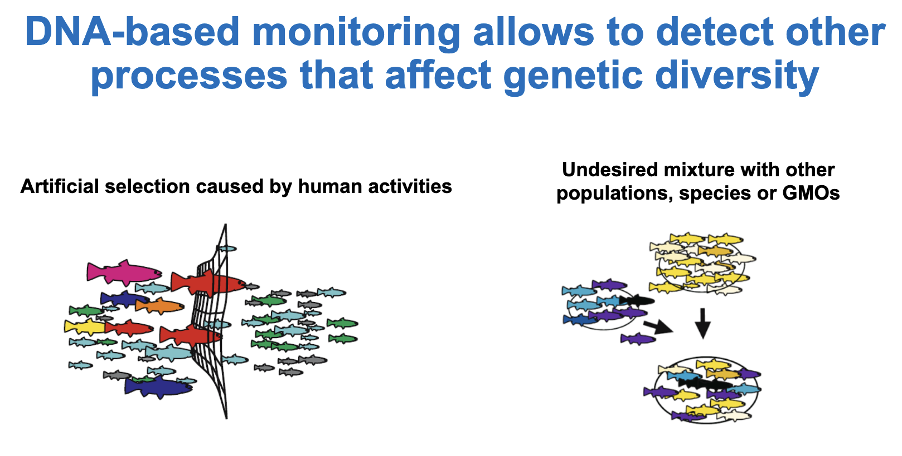
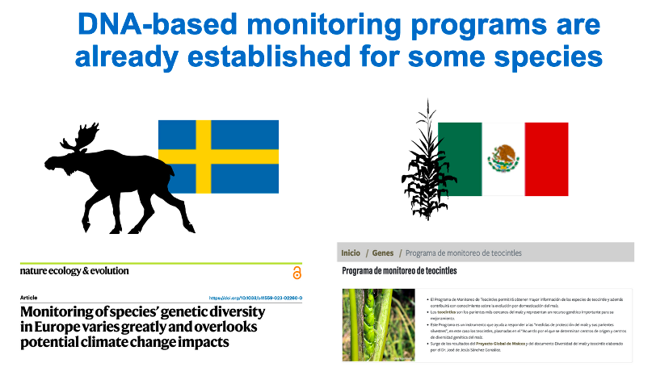

# DNA-based genetic monitoring indicator

Other processes that can affect genetic diversity, such as undesired gene flow with introduced species, populations, or genetically modified organisms, inbreeding, or changes in frequency of genes underlying selection, do require genetic data to be monitored. 

###### Fig 2.6

The DNA-based monitoring indicator is a simple count of the number of species being monitored (temporally) using DNA-based methods. Although this does not directly relate to the maintenance of genetic diversity or preventing genetic erosion, genetic monitoring is critical to informing conservation management actions and this indicator can help gauge country progress in incorporating this critical body of work. Trends in this indicator can be measured with changes in the number of species (or populations) being monitored genetically.

This indicator was not adopted by the GBF, but several countries have started to monitor some species with DNA-based methods (for example see [Charlier et al. 2012](https://doi.org/10.1038/hdy.2012.36), [da Silva et al. 2018](https://doi.org/10.1007/s10592-017-1008-9), [Luna et al. 2022](https://doi.org/10.1093/ornithapp/duac009), [Gajdárová et al. 2023](https://doi.org/10.1016/j.gecco.2023.e02399), [Saha et al. 2024](https://doi.org/10.1007/s10592-023-01586-3))

###### Fig 2.7
