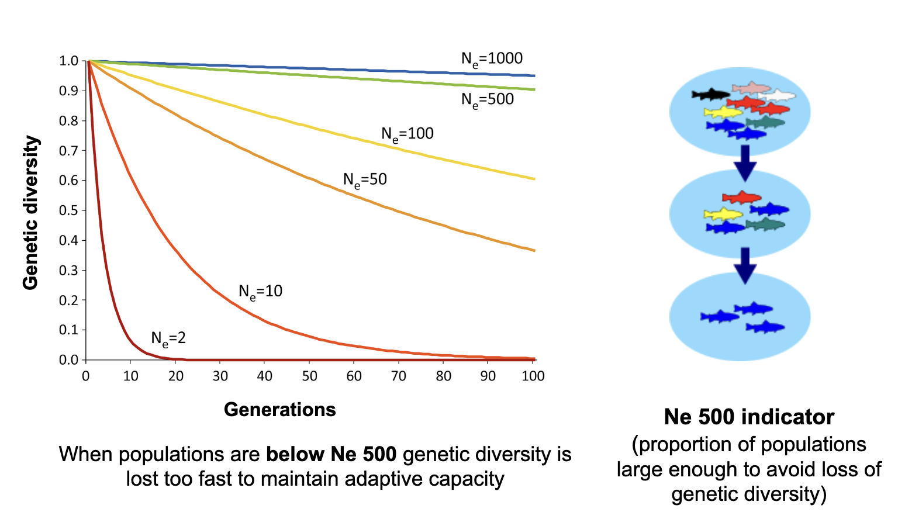
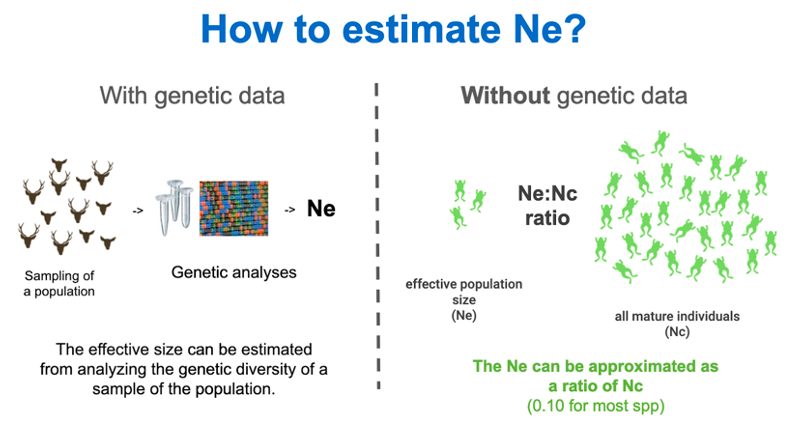

# Ne 500 indicator

The effective population size (Ne) is related to the number of breeding adults in a genetically ideal population (or the number of individuals actually contributing to the gene pool). When Ne is below 500, genetic diversity loss accelerates by a random process called genetic drift. Genetic drift is the change in frequency of an existing gene variant in the population due to random chance. With small effective population sizes, there are fewer adults capable of contributing offspring, and therefore some genetic variants may be lost, by chance.

**Effective population size (Ne) is a well-accepted metric for measuring the rate of loss of genetic diversity within populations.** As explained below (see figure), an Ne above 500 (usually a census population size of 5000) *will maintain genetic diversity within populations for a long time*. In other words, **Ne 500** is a “sufficient” size to **prevent loss of genetic diversity within populations** (using a statistic called ‘heterozygosity’) – Ne much higher than Ne 500 and genetic loss within populations is near zero. See What is a population LINK for a background on how to define a population in the context of the genetic diversity indicators. Ne below 500 is the approximate point when populations are less able to adapt via natural selection, start becoming compromised and experience genetic loss. We note that Ne below 50 will lead to very rapid increases in inbreeding, loss of fitness, and changes in the genetic composition of populations, causing high risk of extinction in the short-term. The Ne 500 and Ne 50 thresholds are useful to conservation management and recovery programmes. Because of a need to maintain genetic diversity and adaptive capacity for the long term, the Ne 500 indicator is a key genetic indicator.

The Ne 500 indicator is derived by comparing **the effective population size (Ne) of each population to a critical threshold**, 500, and reporting the proportion of populations above the threshold and therefore maintaining genetic diversity. 

###### Fig 2.2 *The relationship between effective population size and genetic diversity. Small populations lose genetic diversity more rapidly than large populations, often leading to inbreeding depression and ultimately the complete collapse of the population (extinction). Populations above Ne 500 are capable of maintaining genetic diversity into the long-term.*

The Ne of a population can be estimated with statistical methods and DNA sequence data, when that is available. But for nearly all species, such DNA analysis is not yet available. For many species, it is sufficient and appropriate to obtain the Ne by using a simple transformation of **census size Nc (the number of mature individuals) e.g. using an Ne:Nc ratio.**

###### Fig 2.3

An Ne:Nc conversion ratio of 0.1 generally a conservative and suitable ratio to calculate gauge Ne (although typical ratios may range from 0.1 to about 0.3 in many vertebrates and plants - this is a generalization). **By applying a 0.1 Ne:Nc ratio, Ne 500 translates to a threshold of Nc = 5000** mature individuals.  

Once each population has an Ne value, they are compared against the threshold value of 500. The number of populations with Ne > 500 are summed and divided by the total number of existing populations. For example, a species has 5 populations remaining, 3 of which are above Ne 500. The indicator value for this species would be 3/5 = 0.6. 

From the example, you can see the values for this indicator range between 0 and 1, with 0 indicating all populations have Ne<500 (no populations are large enough to sustain genetic diversity) and 1 indicating that all populations have Ne>500 (all populations are large enough to sustain genetic diversity).

The Ne 500 indicator is likely the best evidence of genetic status and risk of genetic erosion when DNA sequencing is not available (the case for most species globally). It is feasible and scalable for many species per country.  For a detailed explanation on calculating this indicator across multiple species see  [Hoban et al (2023b)](https://doi.org/10.1111/conl.12953) and [Hoban et al 2023c](https://doi.org/10.32942/X2QK5W).

