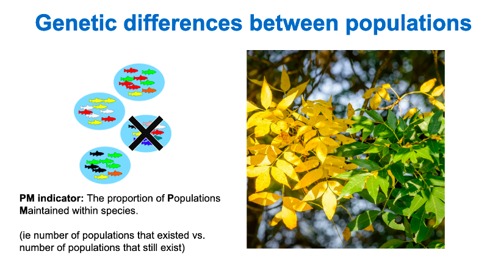
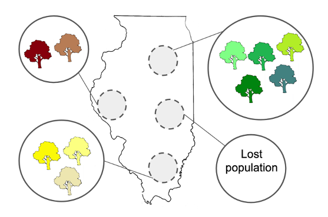

# Populations maintained indicator

In addition to the importance of *within population* genetic diversity, the diversity *among populations* is also critical. The populations maintained (PM) indicator measures **the proportion of populations that still exist compared to the total number of populations that used to occur** (i.e., it is a way of quantifying population extinctions). Each population is presumed to be genetically distinct and locally adapted, for example due to harboring genetic variants that are either absent or rare in other populations. Hence loss of any population within a species equates to the loss of genetic diversity/unique genetic adaptations. See What is a population LINK for a background on how to define a population in the context of the genetic diversity indicators. This is especially relevant considering the unprecedented rate of environmental change we are experiencing the world over. Among population diversity provides insurance, enabling the future persistence of a species and the functioning of ecosystems.

###### Fig 2.4

Several studies have shown that maintenance of populations is necessary to maintain genetic diversity, and the inverse can bring about species collapse. This diversity essentially provides species’ with a protective buffer against threats such as disease, climate change, and more. Without it, species and their ecosystems may be compromised. The overexploitation of fish populations, for example, have not only resulted in reduced population sizes, but the loss of unique alleles and genes, which coupled with climate change, have severely impacted the species’ ability to adapt and recover. In the case of North Atlantic cod, a supergene associated with migratory behaviour has been lost from several populations ([Matschiner et al., 2022](https://doi.org/10.1038/s41559-022-01661-x)). This could change the species’ distribution, altering marine ecosystems, and eventually lead to the extinction of the species.
To calculate the indicator, the number of populations currently existing is divided by the number of populations that previously existed. See How to Guide on Defining Extinct and Extant Populations LINK

Like the Ne 500 indicator, values for this indicator range from 0 to 1, with 0 indicating no populations exist (the species is extinct within the country) and 1 indicating that no populations have been lost. As an example, a species was previously known from 4 populations, but only 3 remain (1 has been lost due to extensive habitat transformation/loss). The PM indicator value for this species would be 3/4 = 0.75 (see Fig. 2.5).

###### Fig 2.5 Genetic diversity among populations of a given tree species. *Each tree population is genetically distinct and locally adapted to its environment (represented by the different colours). A loss of a population can therefore compromise the species’ ability to adapt to future change. PM indicator value: 3/4 = 0.75*

Because data on the number of existing (extant) and extinct populations is needed, a reference baseline time period is needed for the total number of populations. The monitoring framework of the GBF recommends Parties “use the period from 2011–2020, where data is available, as the reference period, unless otherwise indicated, for reporting and monitoring progress” (paragraph 2 of CBD, 2022b). The framework also notes that “baselines, conditions and periods used to express desirable states or levels of ambition in goals and targets should, where relevant, take into account historical trends”. For this reason, we recommend considering a baseline period before the industrial era. Since the exact period representing this varies by country and may depend on the species and what data are available, we suggested Parties use a relatively broad baseline time period of 50–200 years ago for data retrieval, and allowing for more specific baselines to be defined by countries.
