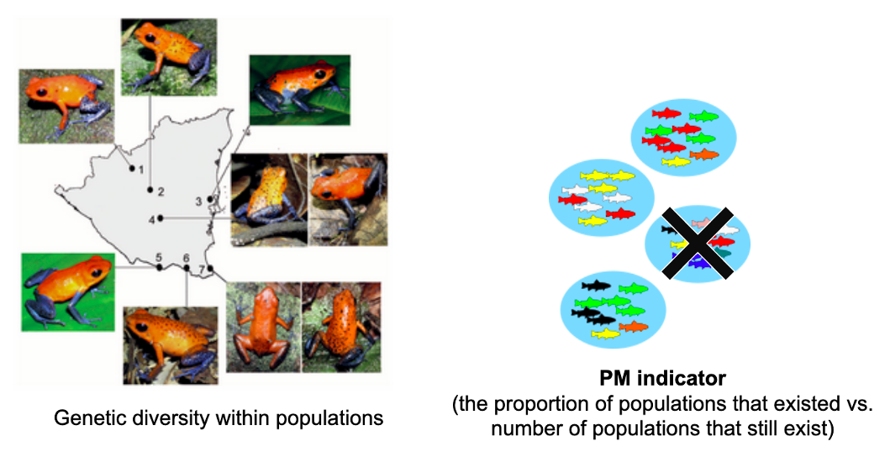

# Populations maintained indicator

In addition to the importance of within population genetic diversity, the diversity between populations is also critical. The populations maintained (PM) indicator measures **the proportion of populations that still exist compared to the total number of populations that used to occur** (i.e., it is a way of quantifying population extinctions). Each population is presumed to be genetically distinct and locally adapted--for example, due to harboring genetic variants that are either absent or rare in other populations. Therefore, loss of any population within a species equates to the loss of unique genetic diversity. See [What is a population](https://ccgenetics.github.io/guidelines-genetic-diversity-indicators/docs/2_Theoretical_background/What-is-a-population.html#what-is-a-population) for a background on how to define a population in the context of the genetic diversity indicators. This is especially relevant considering the unprecedented rate of environmental change locally and globally; between-population diversity provides insurance, enabling the future persistence of a species and the functioning of ecosystems.

###### **Genetic diversity between populations and the Proportion of Maintained Populations indicator**. Left: Colour patterns of strawberry poison frog (*Oophaga pumilio*) in Nicaraguan populations ([Galindo-Uribe et al., 2014](https://www.salamandra-journal.com/index.php/contents/2014-vol-50/380-galindo-uribe-d-j-sunyer-j-s-hauswaldt-a-amezquita-h-proehl-m-vences/file)). Right: each fish population is genetically distinct and exhibits different genetic diversity (represented by the different colors). A loss of a population can therefore compromise the species’ ability to adapt to future changes. Here, the PM indicator value is 3/4 or 0.75.

Maintenance of populations is necessary to provide species options for future adaptation and help prevent species collapse. For instance, many populations in warmer climatic zones can harbor genetic variants adapted to heat stress, drought, or other related challenges. These populations must be maintained to provide the species adaptive capacity for the future. In corals, for example, populations have been identified capable of tolerating much warmer temperatures, and these can help the whole species adapt to warming conditions (by natural migration or human-assisted migration). To calculate the PM indicator, the number of populations currently existing is divided by the number of populations that previously existed. see [How to Guide on Defining Extinct and Extant Populations](https://ccgenetics.github.io/guidelines-genetic-diversity-indicators/docs/3_Howto_guides_examples/Extinct_extant_populations.html#extinct-and-extant-populations). 

Like the Ne 500 indicator, values for this indicator range from 0 to 1, with 0 indicating no populations existing (the species is extinct within the country) and 1 indicating that no populations have been lost. As an example: if a species was previously known from 4 populations, but only 3 remain (1 has been lost due to extensive habitat transformation/loss), then the PM indicator value for this species would be 3/4 or 0.75. See the [Equations](https://ccgenetics.github.io/guidelines-genetic-diversity-indicators/docs/6_Calculations_and_reporting/Equations.html#equations-and-example-calculations) section for more details on calculating this indicator.

[Previous: Ne 500 indicator](https://ccgenetics.github.io/guidelines-genetic-diversity-indicators/docs/2_Theoretical_background/Ne-500.html#ne-500-indicator){: .btn .btn-blue .mr-4 }
[Next: DNA-based monitoring indicator](https://ccgenetics.github.io/guidelines-genetic-diversity-indicators/docs/2_Theoretical_background/DNA-based-monitoring-indicator.html#dna-based-genetic-monitoring-indicator){: .btn .btn-green }
