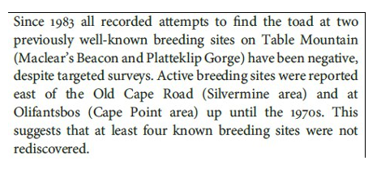
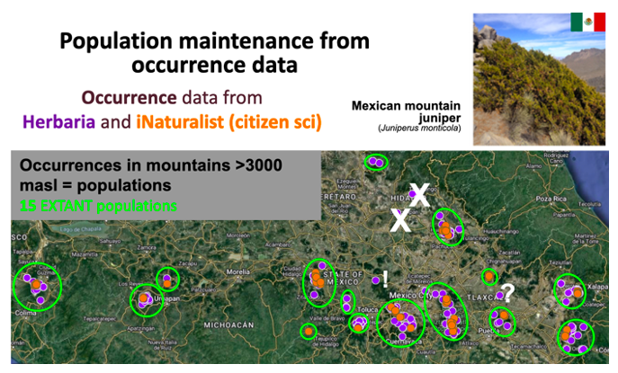

# Extinct and extant populations

Once populations are defined in space and the reference period is decided, try to find the most up-to-date information about the populations in the country. To find information about extinct populations, it is possible to either:

* Find direct reports of population extinction (i.e. when literature or local knowledge holders reports about local extinction, etc.), or

* Comparing historical occurrence data (museum, observations by local experts) to newest occurrence data, in which there are no longer any occurrences where there previously were.

In scientific **direct reports of population extinction**, population loss is mainly reported in the introduction or results sections. For example following paragraph in Cressey et al. (2015) regarding the Rose’s Mountain Toadlet:

Population maintenance can also be evaluated comparing **historical occurrence data**, for instance on the occurrence dates (if there are both old and recent observations, the population is likely still existing) and/or earth observation data showing habitat availability (if extensive land use change has occurred in the region and there are no recent observations, the population is likely extinct). 

###### *Assessing the PM indicator with occurrence data*. Using occurrence data from herbaria (purple dots) and citizen science (orange dots) of the Mexican mountain juniper, 18 populations were defined, each one considering a mountain or group of mountains isolated by lowlands below 3,000 meters above sea level. Of those, the species has been seen recently in 15 populations (green circles), and these are thus considered extant populations. Two populations can be considered extinct (white crosses), because the species was observed decades ago, but there are no recent observations and extensive land use change has occurred that is seen in satellite photos (this was confirmed by consulting local people). In the last population (white question mark) there are no observations in the last decades, but the habitat remains available according to earth observation data, thus it is uncertain whether the population continues to exist. The point marked with a white “!” lacks accurate geographic information, and thus could belong to any of the nearby mountains, so it was not taken into account to define populations.
