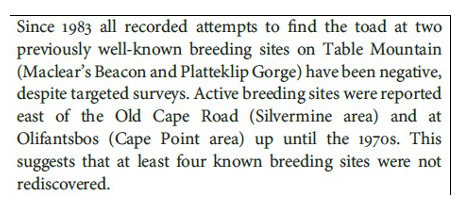
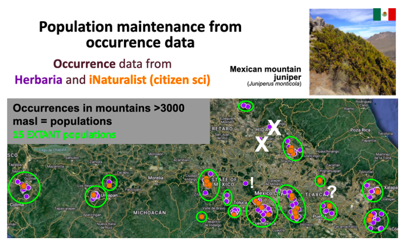

# Extinct and extant populations

Once populations are defined in space and the reference period is decided, try to find the most up-to-date information about the populations in the country. To find information about populations which have gone extinct, it is possible to either:

* Find direct reports of population extinction (i.e. when literature or local knowledge holders reports about local extinction, etc.), or

* Comparing historical occurrence data (museum, observations by local experts) to newest occurrence data, in which there are no longer any occurrences where there previously were.

In scientific **direct reports of population extinction**, population loss is mainly reported in the introduction or results sections. For example following paragraph in [Cressey et al. (2015)](https://www.cambridge.org/core/journals/oryx/article/fading-out-of-view-the-enigmatic-decline-of-roses-mountain-toad-capensibufo-rosei/31E5257B064E82CE7B4D32F1D92805C4) regarding the Rose’s Mountain Toadlet:

Population maintenance can also be evaluated comparing **historical occurrence data**, for instance on the occurrence dates (if there are both old and recent observations, the population is likely still existing) and/or earth observation data showing habitat availability (if extensive land use change has occurred in the region and there are no recent observations, the population is likely extinct). 

###### **Assessing the PM indicator with occurrence data**. Using occurrence data from herbaria (purple dots) and citizen science (orange dots) of the Mexican mountain juniper, 18 populations were defined, each one considering a mountain or group of mountains isolated by lowlands below 3,000 meters above sea level. Of those, the species has been seen recently in 15 populations (green circles), and these are thus considered extant populations. Two populations can be considered extinct (white crosses), because the species was observed decades ago, but there are no recent observations and extensive land use change has occurred that is seen in satellite photos (this was confirmed by consulting local people). In the last population (white question mark) there are no observations in the last decades, but the habitat remains available according to earth observation data, thus it is uncertain whether the population continues to exist. The point marked with a white “!” lacks accurate geographic information, and thus could belong to any of the nearby mountains, so it was not taken into account to define populations.

## Thresholds of Data Recency
When reviewing the available data for calculating indicators, there may not be “recent” data available. Specifically, it may be necessary to assess species’ populations which have been known to exist, but which haven’t been visited recently, such that the current existence and size of that population are unknown. Here, we provide a framework to help handle these situations based on example scenarios with different elapsed time since the population was last observed and trends in population size and/or threat status. 

**Note that this framework is only general guidance. In all cases, assessors can consider completing multiple assessments to reflect uncertainty** (see ["How to account for uncertainty"](https://ccgenetics.github.io/guidelines-genetic-diversity-indicators/docs/3_Howto_guides_examples/uncertainty.html#how-to-account-for-uncertainty-in-the-number-of-populations-population-size-or-nenc-ratio)). For instance, a species could have two assessments: one in which all populations that are “possibly extant” are reported as extant with last known values, and another separate assessment in which those populations are reported as extinct.

The precise years and thresholds mentioned below are examples, and should be adapted to unique scenarios based on the species and landscape, from the expert’s knowledge (as is typical for baselines). 

1. **Scenario 1**: Known past population size trends
  - *Example 1*: Population estimated at 200 individuals in 1980 and 50 individuals in 2000; unvisited since.
  - *Example 2*: Population estimated at 200 individuals in 1980 and 150 individuals in 2000; unvisited since.
  - *Recommendation*: Assuming a known negative trend in population size which would result in zero individuals when extrapolated to the present, no recent (≤10 years) visits, and no removal or mitigation of threat causing decline, the population should very likely be considered extinct (Example 1). Otherwise, if the population size trend indicates a nonzero number of individuals when extrapolated to the present (Example 2), then the population should be considered extant.
2. **Scenario 2**: Unknown population size trends but known threats
  - *Example*: Population estimated at 200 individuals in 1980; unvisited since. However, there are known threats (e.g. habitat loss, disease, poaching, etc.)  to the species and/or the population in question which are ongoing, strongly suggesting population decline.
  - *Recommendation*: Based on threat severity, the organism’s likelihood of persistence given different traits (life span, growth habit, life history, etc.), and available expert opinion, the assessor should make their best judgement about extinction as follows:
    - Population visited and known as extant within the past 20 years: likely consider extant
    - Population not visited in more than 20 years: possibly consider extinct
    - Population not visited in more than 40 years: likely consider extinct. (In the example above, the population would be considered extinct.)
3. **Scenario 3**: Unknown population size trends and unknown threats
  - *Example*: Population estimated at 200 individuals in 1980; unvisited since. No knowledge regarding threats.
  - *Recommendation*: Based on any available expert opinion (including information on life history traits, such as life span), the assessor should make their best judgement about extinction as follows (note that these recommendations are similar to those for Scenario #2, but shift the degree of certainty, since threats are not known):
    - Population visited and known as extant within the past 20 years: consider extant
    - Population not visited in more than 20 years: likely consider extant
    - Population not visited in more than 40 years: possibly consider extinct. (In the example above, two assessments would likely be submitted: one in which the population would be considered extant, and one in which the population would be considered extinct.)

See the ["How to establish a reference period"](https://ccgenetics.github.io/guidelines-genetic-diversity-indicators/docs/3_Howto_guides_examples/Reference_period.html#how-to-establish-a-reference-period) section for guidance on choosing the time period to use as a baseline for indicator values.

[Previous: How to establish a refernce period](https://ccgenetics.github.io/guidelines-genetic-diversity-indicators/docs/3_Howto_guides_examples/Reference_period.html#how-to-establish-a-reference-period){: .btn .btn-blue .mr-4 }
[Next: How to estimate populaion sizes](https://ccgenetics.github.io/guidelines-genetic-diversity-indicators/docs/3_Howto_guides_examples/Populations_sizes.html#how-to-estimate-population-sizes){: .btn .btn-green }
