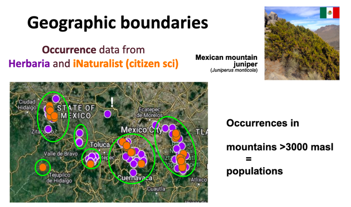
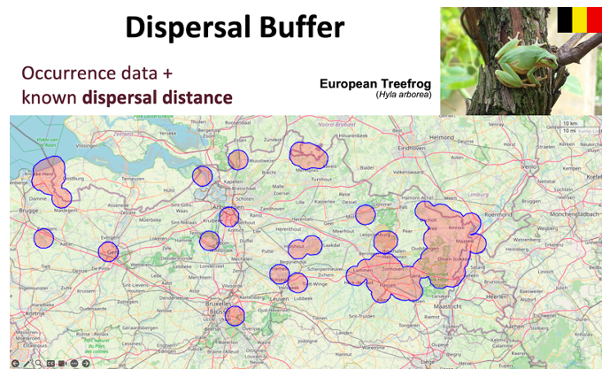
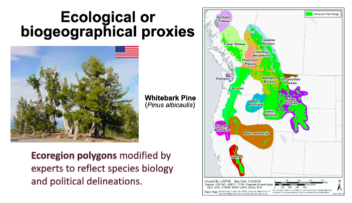
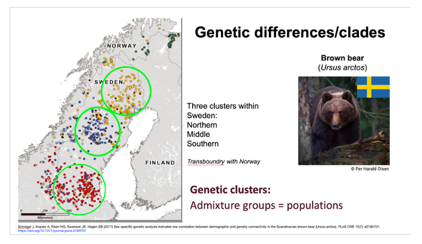
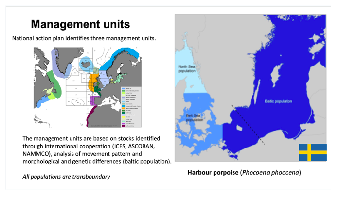

# How to define populations 

A population is a group of individual organisms that can mate with each other  and have low or no connectivity with other populations (see What is a population? section ) . This definition aligns with the IUCN Red List Guidelines definition of a “subpopulation” - geographically or otherwise distinct groups between which there is little demographic or genetic exchange (typically less than one successful migrant individual or gamete per year) ([(IUCN 2001)](https://portals.iucn.org/library/sites/library/files/documents/RL-2001-001.pdf)). 

Genetic differences mostly arise as a product of spatial and temporal isolation, over time due to random processes (genetic drift), and as an effect of population size. Populations separated by more time can have more differences. Designation of populations should also consider human induced gene flow (e.g. reintroductions, translocations). 

Many species’ populations are fairly easy to designate: a population may consist of a cluster of individuals in a discrete location like an island, lake, river catchment or forest preserve, separated from other discrete locations.  

Based on the knowledge of biodiversity and taxonomic experts, definitions of populations will be available in some biodiversity databases, published reports, or expert consultations.  Designating populations may be performed by taxonomic experts, local knowledge holders, or these groups working together.  In other cases, the reports or databases may not clearly designate population boundaries and will require interpretation.  Visual examination of maps may result in ‘merging’ occurrences that are likely to experience extensive gene flow (i.e., within the dispersal distance of the species, lack of clear barriers such as a mountain, fence, river).

There are different methods for determining if a population is distinct, and one or more methods can be used (short definitions are given followed by more detail below).

{: .important } 
Methods to define population can be combined. For instance, populations can be defined using geographic boundaries and traits, or genetic differences and ecological or biogeographic proxies.

* **Geographic boundaries**: when groups of individuals are separated by some uninhabited area which cannot easily be traversed (e.g. river, mountain, different habitat type, or other habitat types which can´t be crossed by the species). This includes human made barriers that likely disrupt movement of organisms for several of their generations (e.g. urbanization, dams).

* **Dispersal buffer**: when dispersal distances are available for a given species one can create buffer polygons around observation points (occurrence points). Polygons that overlap are fused together, and the resulting polygon, along with the points falling within its area, are considered a single population.

* **Ecological or biogeographic proxies**: differences in ecological conditions represent a proxy for potential local adaptations across a species’ range. This may be especially useful for designating populations when groups of individuals occur in continuous fashion across multiple ecological zones, as there may be different local adaptations even in what seems a continuous distribution. In management this may be referred to as ecoregions, seed zones, proxies of genetic differentiation or similar terminology.

* **Traits** (e.g., behavioral, morphological, physiological): when groups of individuals have different traits that may represent adaptations or may prevent interbreeding (such as type of song in birds or whales, adaptation to drier environments etc). 

* **Genetic differences/clades/groups**: when a genetic (DNA-based) study has been performed which shows either (a) no gene flow between groups of individuals, and/or (b) a long period of time in which groups are separated (implying genetic divergence). In this case populations are normally delineated by identified genetic differences, e.g., mtDNA differences, population genetic clustering (STRUCTURE and similar), strong population division (FST), unique alleles, and other methods.

* **Evolutionary significant units (ESUs)**: an ESU is a genetic unit present within a species, more specifically it is a “lineage demonstrating highly restricted gene flow from other such lineages within the higher organizational level (lineage) of the species". It can consist of a single population or group of them.

* **Management Units** (demography/ migration): when biologists at a management agency have identified boundaries in an otherwise continuous species range, recognizing that management (and adaptation) does need some delineation. Note that these defined units are often demographically distinct, but may sometimes just represent political or other boundaries.

## Methods to define populations

### Geographic boundaries

This is the most easily observed definition of a population when a species’ range map or satellite photos are available. It may be possible to distinguish groups of individuals separated by some uninhabited area which cannot easily be traversed (river, mountain, different habitat type, or simply a span of unoccupied habitat). This includes human made barriers that likely disrupt movement of organisms for several of their generations (e.g. urbanization, dams).

This method focuses mostly on discrete populations separated by barriers that cannot be crossed e.g. a deep canyon or river, which can separate populations that are even very close, or isolated mountain tops. For example, the mexican montane juniper (*Juniperus monticola*) grows in isolated mountain tops above 3,000 meters above sea level, each one can be considered a population. 

 
###### **Example of geographic boundaries to define populations.** In the Mexican mountain juniper, populations can be defined as a mountain or group of mountains isolated by lowlands below 3,000 meters above sea level. Occurrence data can come from herbaria (purple dots) and citizen science (orange dots). Before assigning an occurrence point to a mountain, it is important to check the taxonomic and georeference data of each occurrence. For instance, the point marked with a white “!” lacks accurate geographic information, and thus could belong to any of the nearby mountains, instead of the location where it appears. 
{: .no_toc }

### Dispersal buffer

The distance between groups of organisms obtained from occurrence data can be used to determine if they are likely genetically connected. When the edge of a group is within a reasonable dispersal distance (for that particular species, a distance within which some 95-99% of realized dispersal distances occur) of another group’s edge, and there are no known physical barriers impeding dispersal, the groups can be considered as connected and part of the same population (sometimes called a metapopulation). 

Defining populations with dispersal buffers consists of creating buffer polygons based on reported dispersal distances for each species around observation points (e.g. 10 km radius), which are used as occurrence points. Polygons that overlap are fused together, and the resulting polygon, along with the occurrences falling within its area, is considered a single population. This approach assumes that the boundaries of each population are accurately defined, and that individuals within each population have the potential to interact and mate with one another. 

{: .note }
When seeds, pollen or spores can disperse the organism's genes, the longest dispersal distance of these (often but not always pollen) should be used. 

###### **Example of Dispersal Buffer.** For the *Hyla arborea* populations in Belgium, occurrence points were derived from citizen science data (waarnemingen.be), and polygons were generated based on the reported dispersal range (4 km). These polygons were evaluated by experts in the group, and those where physical barriers affected individual dispersal, as well as polygons derived from a single observation within the period analyzed, were excluded from further analysis.
{: .no_toc }

### Ecological or biogeographic proxies

Ecoregions or other biogeographic proxies for ecological or seed zones can be used to delineate populations, especially in widespread or continuously distributed species. Differences in ecological conditions represent a proxy for potential local adaptations across a species’ range. This reflects the fact that genetic exchange is limited across the range; in such cases the use of ecological maps may be the only way to designate populations. In practice, the species’ range map can be overlaid on the map of ecoregions, with modifications as needed to reflect the underlying biology or management of the species.

###### **Example for Ecological or Biogeographic proxies**. Whitebark pine (*Pinus albicaulis*) has an extensive range across western North America (bright green polygons) that spans multiple ecoregions (other colored and labeled polygons), which are defined by similarities in ecosystems, topography, geology, soils, and climate. For the indicators assessment for whitebark pine, ecoregion polygons were slightly modified to reflect whitebark pine biology (defined by experts) and political delineations (U.S. vs. Canadian jurisdiction).
{: .no_toc }

### Traits 

Traits are observed physical differences (e.g. size, color patterns), or other differences between populations, such as timing of migration, or different mating calls, that have been recognized by experts on the taxon. Groups of individuals may be continuous in space, but some groups of individuals have different traits that may represent adaptations or may prevent interbreeding. These may be adaptations to soil types that occur in close proximity in which offspring produced from mating between these locations do not survive. 

### Genetic differences/clades

A genetic (DNA-based) study may be used to demonstrate either (a) no gene flow between groups of individuals, and/or (b) shows a long period of time in which groups are separated (implying genetic divergence). This conclusion should be based on a genetic study that covers the relevant area in question, with sufficient sampling (e.g. no relevant populations are not sampled) and with appropriate genetic markers (consulting a geneticist may be needed). Examples of significant genetic differences include high FST values (not just ‘significant’ FST, as very small differences can still be statistically significant), diverged mitochondrial DNA. We note that not all genetic clusters are distinct populations (because again, even small differences can now be detected due to genomic sequencing; please consult a population geneticist for any clarification). We argue that one should consider the  threshold of roughly less than 1 migrant per generation (on average).  Older genetic markers such as chloroplast and mitochondrial DNA sequence are useful in identifying highly genetically distinct populations (though an absence of differences at these markers is not evidence of lack of population barriers).

###### **Example for genetic differences/clades.** Populations of Brown bear (*Ursus arctos*) in Sweden were defined based on genetic clusters recovered in several studies. Both microsatellite and SNP data indicate three genetic clusters that correspond to previously identified areas of brown bear concentration. In the late 1800s the species was pushed back into four separate areas and declined to approximately 100 individuals due to intense hunting. Since being protected in 1927 they have expanded from these areas. 
{: .no_toc }

### Evolutionary significant units (ESUs)

An ESU is a genetic unit present within a species, defined as a “lineage demonstrating highly restricted gene flow from other such lineages within the higher organizational level (lineage) of the species" (Fraser and Bernatchez 2001). It can consist of a single population or group of them, therefore in some instances the number of ESUs and the number of populations would be the same, but not always. ESUs normally are established using several sources of evidence, including genetic and ecological distinctiveness (Funk et al 2012). ESUs are sometimes reported in scientific papers or management reports, and can be used to define populations. However, keep in mind that ESUs tend to be a higher clustering level, and hence for the genetic monitoring purpose some of them could be splitted.

###### **Example of Evolutionary Significant Units to define populations**. In *Juniperus blancoi* populations were defined based on ESUs previously described from several lines of evidence. Genetic studies (Mastretta-Yanes et al 2012; Moreno-Letelier et al 2014) found strong population structure based on short DNA sequences. There are also 3 taxonomic varieties (*blancoi, mucronata* and *huehuentensis*) that do not match the former structure. Mastretta-Yanes et al (2012) delimited 5 conservation units (equivalent to ESUs) based on historical, genetic and ecological exchangeability. To define populations for the indicators, the CU of Mastretta-Yanes et al (2012) were used, but subdividing the isolated (> 150 km apart) geographic localities within them, due to genetic evidence of low gene flow. The newly discovered population of Cerro Gordo, Durango for which there is no genetic data was also considered as different population from the rest due to their geographic isolation. The newly discovered population Coscomate for which there is also no genetic data was grouped with El Salto due to its geographic proximity and similar habitat.
{: .no_toc }

 
### Management Units 

This category should be avoided if possible, as it may align sometimes more with agency needs or political boundaries, but may be useful and necessary if the other methods cannot be applied, and sometimes it does align with demographic distinction (e.g. no migration, [Palsboll et al., 2007](https://doi.org/10.1016/j.tree.2006.09.003)). For managed species, biologists at a management agency may have identified boundaries based on an intuition of adaptation or lack of mating among groups. These units could simply recognize that management takes place at certain spatial scales and some practical boundaries are needed for logistics, for instance within different protected areas (e.g. National Parks) or wild-life enclosures. But notice that if units are surrounded by human-made barriers, like lands converted to agriculture, other methods to define population may also be used.

###### **Example for Management Units.** The Harbour porpoise (*Phocoena phocoena*) is a highly mobile marine mammal. However, genetic and morphological studies indicate that the individuals in the Baltic Sea are differentiated from individuals in the Belt Sea and North sea. Harbour porpoise is monitored and managed through international cooperation based on identified stocks and different areas of assessment. In Sweden, there is a national action plan for Harbour porpoise that identifies three management units within Swedish waters.  
{: .no_toc }

## Metapopulations and when locations change over time

A population may constitute a metapopulation consisting of numerous small localities (ponds, prairies, etc.) that are separate but not very far (hundreds of meters to several kilometers, depending on the species dispersal capacity), thus capable of exchanging at least 1 migrant (one reproductive adult moving between patches) on average per generation per year. In such cases, the population size should be considered the sum of the individual locations (termed subpopulations), which may cover tens or hundreds of kilometers.  

Metapopulations should represent stable spatial and temporal units. Many species have ephemeral subpopulations in dynamic source-sink metapopulations- a sink is a spatial location receiving high immigration from adjacent areas and which would not persist on its own without immigration. Sinks are not distinct populations. The conglomerate of connected subpopulations that should be evaluated as a population.

[Previous: Species list](https://ccgenetics.github.io/guidelines-genetic-diversity-indicators/docs/4_Species_list/Species_list.html#species-list){: .btn .btn-blue .mr-4 }
[Next: How to establish a reference period](https://ccgenetics.github.io/guidelines-genetic-diversity-indicators/docs/3_Howto_guides_examples/Reference_period.html#how-to-establish-a-reference-period){: .btn .btn-green }
