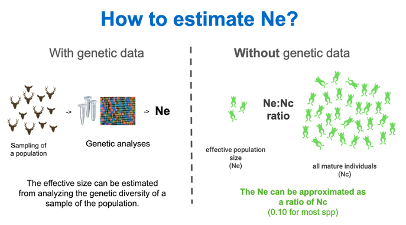
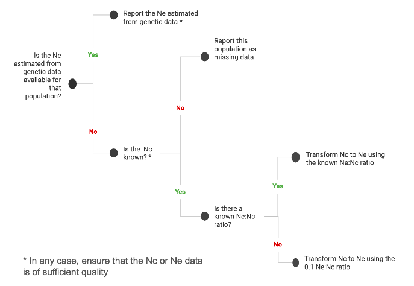
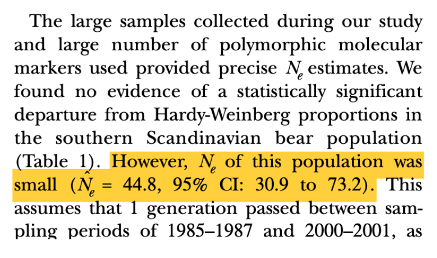
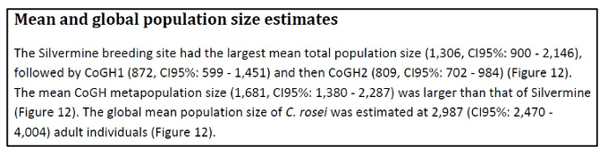

# How to estimate population sizes

Here we refer to Ne as contemporary effective population size, measuring genetic drift (see also [Glossary](https://ccgenetics.github.io/guidelines-genetic-diversity-indicators/docs/7_Glossary/Glossary.html#glossary) for a more technical definition on Ne and [Background of the Ne 500 indicator](https://ccgenetics.github.io/guidelines-genetic-diversity-indicators/docs/2_Theoretical_background/Ne-500.html#ne-500-indicator))

Shortly, the Ne of a population can be obtained in two ways:

* **Statistical analysis of DNA sequence data**, when these are available. This will often involve a scientific study where Ne will be estimated and published as part of other genetic diversity summary statistics.

* If genetic data is not available, a simple transformation of **census size** (**Nc;  the number of mature individuals) to an Ne using an Ne/Nc ratio is possible.**  An Ne/Nc conversion ratio of 0.1 is generally a conservative and suitable ratio to calculate Ne (although this is a generalization, and typical ratios may range from 0.1 to about 0.3 in many vertebrates and plants; see [Hoban et al. 2021](https://www.sciencedirect.com/science/article/abs/pii/S0006320720309642?via%3Dihub)). **By applying a 0.1 Ne/Nc ratio, Ne = 500 translates to a threshold of Nc = 5,000** mature individuals.  Notice that for species with asexual reproduction (clones) the Nc should be interpreted with care (see below) and section: When the [Ne/Nc ratio](https://ccgenetics.github.io/guidelines-genetic-diversity-indicators/docs/7_Glossary/Glossary.html#nenc-ratio) can’t be used.

###### **The effective population size (Ne)** can be obtained by analyzing the genetic diversity of sample of the population, using statistical methods and DNA sequence data. If genetic data is not available, the Ne can be obtained from a simple transformation of the census size (Nc;  the number of mature individuals) through the use of  an Ne/Nc ratio.

The following decision tree illustrates a workflow for obtaining Ne depending on the  data that is available:

###### Decision tree to obtain the Ne of a given population, depending on data availability.

Depending on the species and the population, Ne from genetic studies or Nc data may be available, or both. While in some cases the Ne estimated from genetic data would be the more accurate (with some exceptions, such as in very large populations of trees and fish, where genetic Ne estimates are not valid), if the Nc data is also available, it is recommended to record both and compare the results obtained, or to perform the assessment using both values to account for uncertainty. 

The following sections briefly explain how to obtain the Ne or Nc from scientific studies, public databases, or collaborating with taxon experts or local people. 

## How to get Ne from genetic studies

### How do I find genetic studies reporting Ne?
The Ne is often estimated by scientific studies reporting on genetic diversity. You can use a scientific literature search engine with the species name +  “effective population size  OR  Ne”. Mainly look into the Abstract or Results sections of literature (especially in Tables) to find if study reports Ne. 

To make sure that the study reports the **contemporary Ne** and not the “historical Ne”, you can check the Methods section of the study. Studies reporting the contemporary Ne should have used one of the following methods and software:

* Linkage disequilibrium (e.g., LDNE, NeEstimator, SNeP)

* Heterozygosity excess (e.g., NeEstimator)

* Temporal changes in allele frequency (e.g., MLNE, NeEstimator, TempoFS)

* Genetic relatedness [sibship/parentage] (e.g., Colony, NeEstimator)

* Approximate Bayesian Computation (e.g., ONESAMP)

* Demographic approaches to estimating contemporary Ne (e.g., [Nunney and Elam, 1994](https://doi.org/10.1046/j.1523-1739.1994.08010175.x)) (Note this does not require genetic data)

Another strategy, used in a recent meta-analysis by [Clarke et al. 2024](https://onlinelibrary.wiley.com/doi/10.1111/mec.17353) is looking at articles that cited the original papers of the aforementioned Ne estimation software packages to check if any of these articles are related to species within the country of interest. 

Other methods and programs may arise, you can double check in the documentation of that program if it is used to estimate the contemporary Ne. 

{: .warning }
If a program or method focuses on estimating the historical Ne it is **not** useful for the context of the genetic diversity indicators. For instance, if historic effective population size is estimated using a pairwise Markovian coalescent (PSMC) approach, or using the software program GONE, unfortunately, it cannot be used for the Ne indicator, even if recent Ne estimates from this method are reported.

{: .warning }
Just because an Ne value is available does **not** mean that should be utilized. Because the Ne 500 indicator is meant to be applied at the metapopulation level, rather than the local population level, avoid using Ne estimates which are calculated for small, isolated populations. See the section describing [metapopulations](https://ccgenetics.github.io/guidelines-genetic-diversity-indicators/docs/3_Howto_guides_examples/Howto_define_populations.html#metapopulations) for more details.

### Where and how is the Ne reported in a scientific paper?
Papers reporting Ne will usually have the Ne values  in a table or in the results section. For example, see the following excerpt from [Tallmon et al. 2004](https://wildlife.onlinelibrary.wiley.com/doi/abs/10.2193/0022-541X(2004)068[0960:GMOSBB]2.0.CO;2) study on Ne from brown bear in Sweden: 

In the above example, the point value for Ne is 44.8, the other numbers are the confidence interval (CI), which in this case include the lower limit (30.9) and the upper (73.2). While we need only the point value to estimate the indicator, it is good practice to record the CI for more detailed analyses reporting uncertainty. 

{: .Important }
Tip: Use [control + F] to search for keywords such as “effective population size”, “effective size”, or “Ne” through the document.

## How to get the Nc?

For some organisms, assessment of Nc is fairly straightforward. It is **the number of reproductively mature individuals**, that is, those which are of sufficient maturity to produce gametes or offspring.

A count of mature individuals may mean an actual count of all organisms, an estimate made by counting within given units of area and extrapolating, or an estimate from an approach such as a capture-mark-recapture model. The [IUCN Red List Guidelines](https://www.iucnredlist.org/resources/redlistguidelines) (IUCN Standards and Petitions Committee 2022) contains extensive discussion on consideration of reproductively suppressed individuals, trees, fish, and other cases of interest, and we suggest adhering to this guidance in its entirety with one exception: **clonal organisms**. 

{: .important }
**Note on clonal organisms**: In assessing Nc for the use of converting to Ne, it is important to use the “genet” (the genetically distinct organism) as opposed to the “ramet” (each distinct part which is capable of surviving on its own). An extreme example is a *Populus* clone which may have thousands of stems aboveground which are each capable of reproduction, but which are identical in their genotype.  This clone formed over thousands of years.  The assessor should consider each entire clone as a mature individual when counting Nc, not each stem. This can be done similar to the advice on page 28 of the aforementioned IUCN Red List Guidelines, e.g. “For diffuse, wholly visible organisms in continuous habitats (e.g., reef-forming corals, algal mats) assessors may assume an average area occupied by a genet and estimate the number of genets from the area covered by the taxon. The area covered by the taxon should be estimated at a scale (grid size; e.g. 1 m²) that is as close as practicable to the area assumed to be occupied by a genet.” The typical area covered by a genet can be determined by consulting scientific literature on a similar organism (as above, many estimates are available for corals and *Populus*), contacting an expert in that species or genus, which may include contacting an IUCN Specialist Group for that taxon or the IUCN Conservation Genetic Specialist Group.

Some other cautions to consider when obtaining Nc are:

* Sometimes a count of organisms observed is available but it is not meant as an estimate of Nc.

* Sometimes a count is not the same as the number of reproductive individuals; for example, a count including juveniles, a count of ramets, a count of fruiting bodies, etc.

Census population size **can be available in two forms:**

**Point estimates** quantitative data with or without confidence intervals, as well as round estimates. Examples:

* Point estimate with confidence interval: 300 [250, 400]

* Point estimate without confidence interval: 300

* Round estimates: “expert says around 300” 

Point estimates are more often produced by scientific studies or reports where the population size was estimated following a sampling and statistical method, or where it is possible to actually count individuals.

**Quantitative range or qualitative estimates:** includes semi-qualitative measures or a range, without providing a point number. Examples:

* “1,000 to 2,000 individuals”

* “Experts says a few hundreds” 

Including this type of estimates allows local knowledge holders, like indigenous peoples and local communities, park rangers, botanists or citizen scientists who are active at the local level to contribute to the assessments and the overall monitoring of taxa. 

To facilitate participation and conversion of Nc to Ne, we suggest simplifying the possible ranges into the following categories:

* < 5,000 by much

* < 5,000 but not by much (tens or a few hundred less)

* \> 5,000 but not by much (tens or a few hundred more)

* \> 5,000 by much

* estimate is a range including both less and greater than 5,000 (e.g. "3,000 to 10,000")
  
Then, populations noted as having slightly more than 5,000 individuals can be allocated a census size of 5,500. This value is 10% above the minimum threshold value for populations at risk of extinction in the long-term (i.e. Ne 500; Nc 5,000, assuming a 0.1 Ne/Nc ratio). Populations classified as being substantially larger than 5,000 individuals can be assigned a value of 10,000 (double) the minimum threshold. For populations estimated at having a census size just under 5,000, a value of 4,500 can be assigned, being 10% below the minimum threshold; and populations with considerably fewer than 5,000 individuals can be given a value of 500, by similar logic indicating their increased risk of extinction in the short-term (corresponding to Ne = 50). These adjustments are made in the [R scripts](https://ccgenetics.github.io/guidelines-genetic-diversity-indicators/docs/6_Calculations_and_reporting/R_scripts.html) used to process data gathered in a [KOBO form](https://ccgenetics.github.io/guidelines-genetic-diversity-indicators/docs/5_Data_collection/Web_tool.html).

### How do I find studies reporting Nc? and Where and how is the Nc reported?

In animals, the Nc is often estimated by scientific studies or wildlife monitoring which reports an estimate from a model (such as a capture-mark-recapture model). In plants, estimates are more often done by counting actual individuals as part of specific-species monitoring or vegetation surveys, or as an estimate made by counting within given units of area and extrapolating. 

To search, you can use a scientific literature search engine with the species name +  “census population size”, “Nc” or “abundance”. You can also add “capture-mark-recapture” or other methods to your search for animal species. Mainly look into the Abstract or Results sections of literature (especially in Tables) to see if any study reports Nc. For plants, you can also search forestry reports and databases, include the search term “density” (in addition to those listed aboce), as density in a given area is often reported and it can be extrapolated if the inhabited area is known. 

Studies reporting Nc will usually have the Nc values in a table or in the results section. For example, the following text extract from Becker et al. (2017):

Or the following table extract from the Species Status Assessment Report for Beach Layia ([USFWS, 2018](https://iris.fws.gov/APPS/ServCat/DownloadFile/185500)):

[Previous: Extinct and extant populations](https://ccgenetics.github.io/guidelines-genetic-diversity-indicators/docs/3_Howto_guides_examples/Extinct_extant_populations.html#extinct-and-extant-populations){: .btn .btn-blue .mr-4 }
[Next: How to get the Ne/Nc ratio](https://ccgenetics.github.io/guidelines-genetic-diversity-indicators/docs/3_Howto_guides_examples/Ne_Nc-ratio.html#how-to-get-the-nenc-ratio){: .btn .btn-green }

