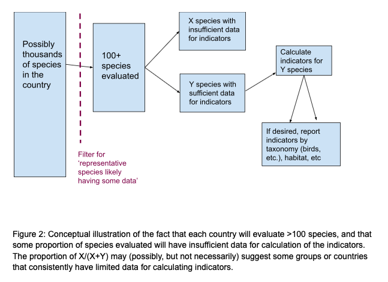

# Species list
{: .no_toc }

In this section we discuss how many species and which species should be evaluated to assess the genetic diversity indicator for a country.

## Table of contents
{: .no_toc .text-delta }

1. TOC
{:toc}

## On the definition of subspecies, and issues of taxonomy

Generally, we are assessing indicators at the species level. However, taxonomic uncertainty, disagreement, and revision can be common in some groups (i.e., lumping and splitting of species). In these cases, species may be better assessed at finer (subspecific) scales to more easily accommodate change over time. Additionally, assessors may choose to assess entities at the subspecific level if the subspecies is an important unit for that country (e.g., it has separate reports, protection, or Red List status).

## Creating species lists 

Each country team should begin by making a list of at least 100 candidate species for which there is likely some data for the indicators. ‘Likely to have some data’ means that the species are not recently discovered, poorly known, part of a group with highly uncertain taxonomy, very difficult to assess (e.g., they are countable by observation, camera trap, etc.), etc. This candidate list becomes the list of species to try to collect data for. 

Below, we provide two approaches for constructing the candidate list of 100 species, though other approaches or a blend of approaches is fine.  

1. First, compose a list of species at the country level that a national biodiversity expert or panel of experts thinks might have data. Then, cross check this list against relevant sources of data to narrow it down (e.g., removing species for which there are no published reports, articles, websites, databases, or experts available). Note that this approach could lead to over-representation of well-known, flagship, or economically important species.  
 
2. Choose one or two prominent data sources (e.g. recovery plans or similar), list all species in that data source, and pick species from this list in a stratified random fashion to cover taxonomy, habitat, etc.. For example, this might involve going through recovery plans for all federally listed Endangered Species, the national Red List, or other lists of conservation concern (e.g., Annex II, IV and V species of the EU Habitats Directive). Note that this could lead to overrepresentation of species of conservation concern/ underrepresentation of common or "least concern" species. Many countries have Red Lists for various taxonomic groups.  These lists could also help ensure each threatened status is represented (Endangered, Least Concern, etc).  Note: many Least Concern IUCN species are nevertheless of local or regional conservation concern, and are declining rapidly, etc. so should not be ignored.

**It is vital to document how the list is developed in order to identify any biases (e.g. mostly common species).** In this project, and in the first use of the indicators by a country for National Reporting, **it is acceptable to have some biases**, but as data quality and collection efforts improve, biases should decrease. Multiple data sources may be needed (for example: evaluate the Red List to see what species have data available, and consult with experts on other data sources).

It is not necessary for all chosen species to have high quality data across their range. While indicators would be more accurate if all species have data for all populations, complete population data may only be available rarely. It is ok if data are available for only one of the two indicators or for only some populations of a species (as explained under Common Issues below). Moreover, upon investigation, species initially deemed likely to have some data, may actually have insufficient data to calculate either indicator. Species should not be removed from the list after the initial list is made. We will calculate the indicators with and without various types and levels of missing data.

There are some species where it will be particularly hard or impossible to quantify Indicators 1 and 2, and they should be excluded from the species list. For example, evaluation of the Ne>500 indicator will be hard in species where natural subpopulations are typically very large and/or hard to measure, such as microcrustaceans, many insects, some fungi, highly clonal organisms, some plants with deep soil seed banks (where all ‘individuals’ cannot be counted).   Populations of such species can also grow in a short amount of time to very large numbers and have high standing genetic variation (Chaturvedi et al. 2021).  _We advise not attempting to include such species in a country’s first evaluation of these indicators due to difficulty in finding and interpreting data._

## How to choose a diversity of species

As noted above, candidate lists might include species with management or recovery plans, species that have been Red List assessed, species of known ecological or economic importance, species of national concern, or species monitored by a national biodiversity entity or citizen scientists. Ideally, candidate lists should be **representative** (e.g., able to provide a typical picture of what other species are experiencing for the indicators).This may include species of commercial interest, but should not be limited to commercially important species. If possible, the species should represent a diversity of at least some of: 

*Ecosystems / biomes within the country (e.g. temperate forests, rainforest, etc)

*Taxonomic groups (e.g. mammals, invertebrates, herpetofauna, plants, birds, fish)

*Terrestrial and aquatic realms

*Range size and commonness (see Kobo form for descriptions of terms)

*Threatened status (threatened or not)

If possible, also include a range of:

*Value (economic, ecological, social) 

*Traits (body size, lifespan/ generation time, dispersal)

Selected wild species should generally be native (e.g. non-introduced, non-invasive). However the indicators can also be applied to some proportion of non-native crops, domesticated animals, and crop wild relatives, depending on country goals and priorities.  
The ability to fully include all of these areas will vary by country, due to native levels of biodiversity and capacity/ data availability. Further discussion of categories of species can be found in [Hollingsworth et al 2020](https://nora.nerc.ac.uk/id/eprint/526707/1/N526707CR.pdf), page 17-19. Full taxonomic and ecological diversity will be difficult (and often impossible) for the first-time assessment of the indicators. As mentioned above, some bias in species selection is expected and is acceptable as long as species selection is well documented. Given clear documentation of the selection approach,concerns about bias should not prevent initial assessments of the indicators since the first effort helps a country set up the infrastructure and methods of data gathering and analysis. 

## Minimum number of species to assess 

We recommend evaluating a minimum of 100 species in order to ensure a sufficiently representative and diverse sample (e.g., across taxonomic groups, ecosystem types, threat status, commonness, etc.) is taken within each country.
 
## Keep the same species list while collecting data 

It is important to fill in the Kobo form for every species on the 100+ species list, even if there is little data available, and even if the indicator cannot be calculated. In other words, we expect some proportion of the species list to have no useful data at the time of assessment (see Fig 2). Knowing how much data is missing will provide valuable insight into challenges countries face in assessing species and where data are lacking. Additionally, this information may encourage additional data collection over time to fill in gaps in biodiversity knowledge. However, if missing data is extensive (say, >50% of the species list), country teams may revisit their original species list and continue to add more species. 

