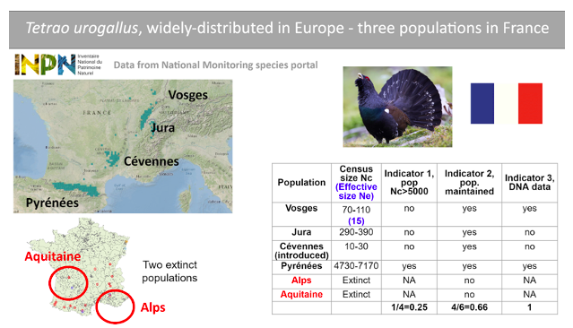
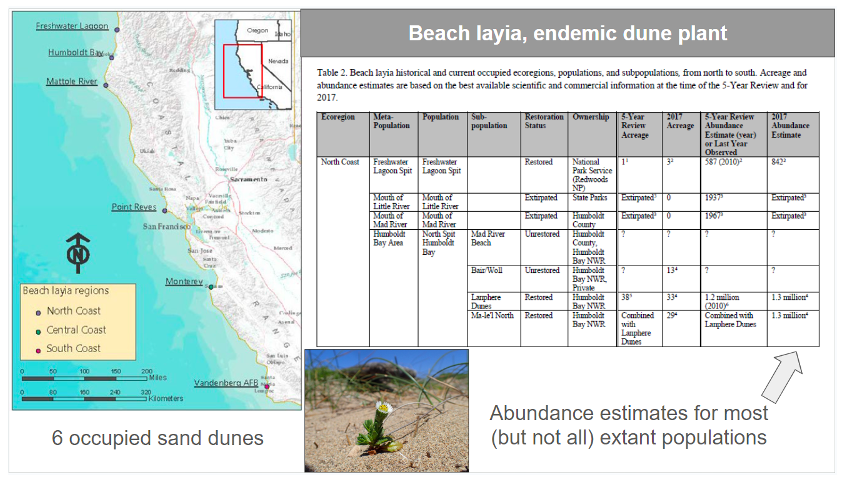
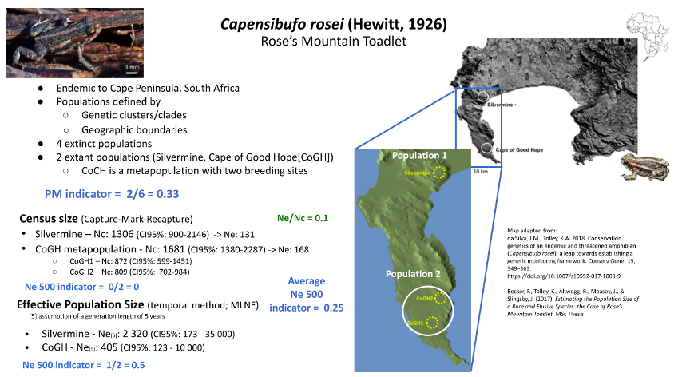
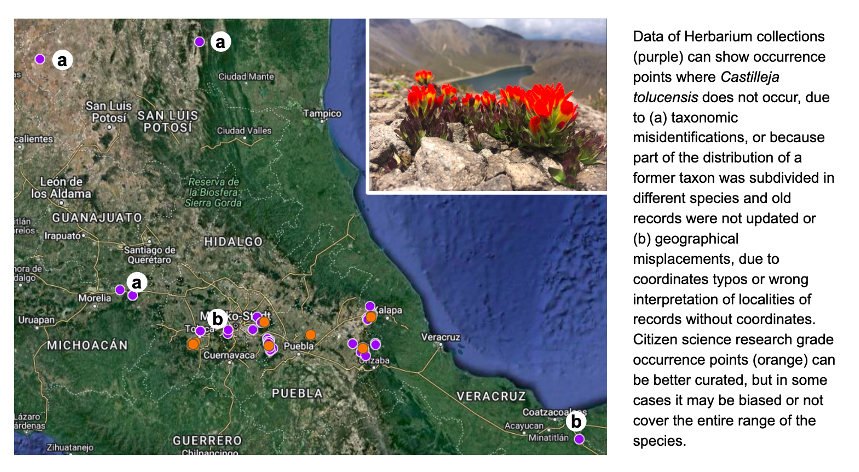
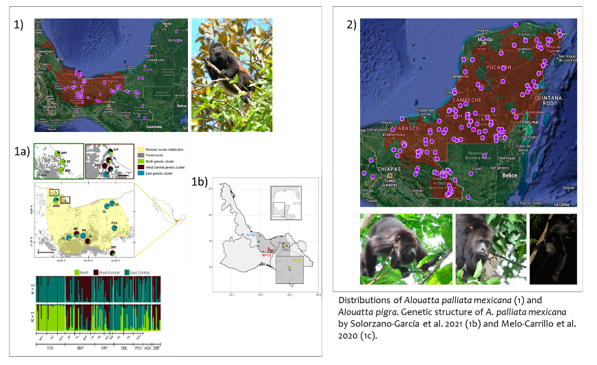
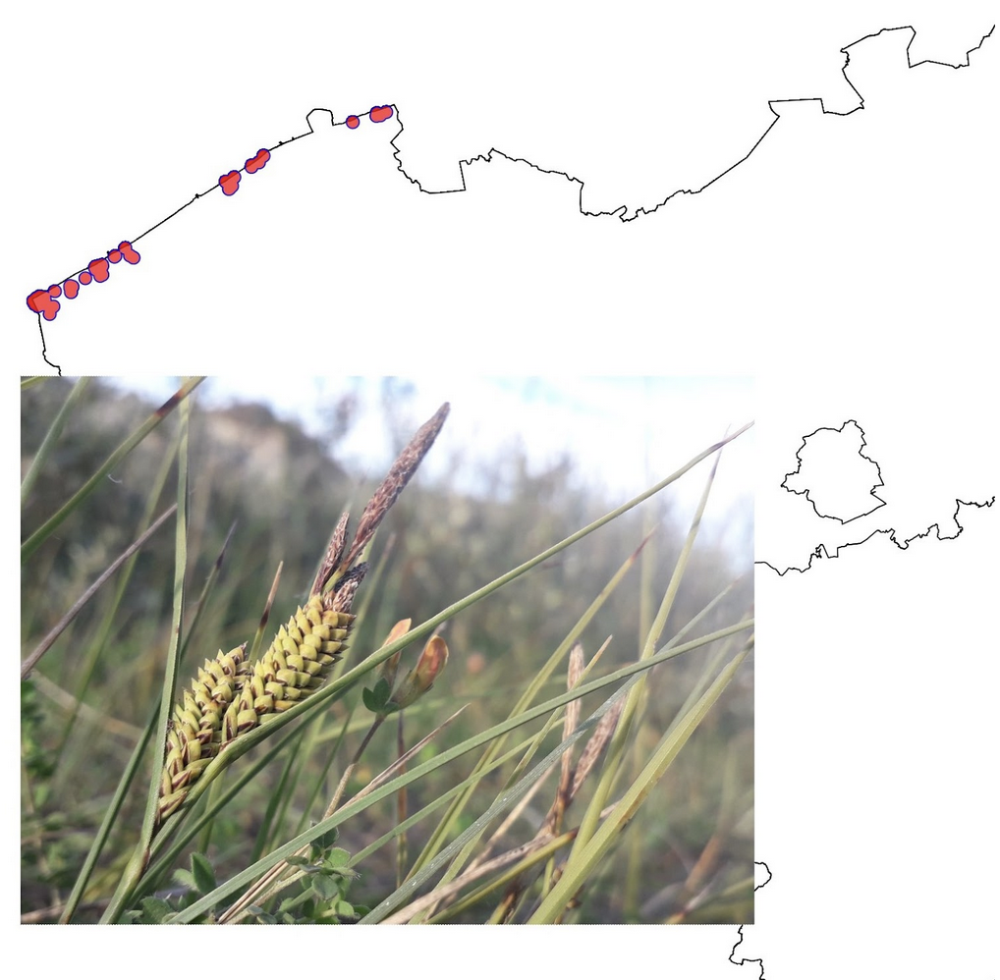

# Example assessments
{: .no_toc }

Here are some real-life examples of assessing the genetic diversity indicators in different species, using different kinds of data.

## Table of contents
{: .no_toc .text-delta }

1. TOC
{:toc}

## Example assessments in a nutshell

The following examples describe common situations when assessing the indicators using both non-genetic and genetic data.

### Eurasian capercaillie (*Tetrao urogallus*), a widely distributed bird

This is a large bird species with a wide distribution in northern and north-eastern Europe but a fragmented distribution in western Europe. There are currently four populations (Pyrénées, Jura, Vosges, Cévennes) remaining in France, one of which is the result of an introduction (the Cévennes population) and there is information on the recent disappearance of two populations (Alps and Aquitaine). The PM indicator is thus 4/6. Contemporary effective population size (Ne) based on DNA analysis is available for only one extant population (Vosges population, with Ne<500), and census size estimates are available for the four extant populations. Only one population (Pyrénées) is large enough to meet the criterion Nc>5000, which converts to Ne>500 using the recommended ratio of Ne/Nc=0.1. Therefore the Ne>500 indicator is 1 population in 4, or 1/4. Two of these populations have been  monitored using DNA data, one including direct Ne estimations; this species thus counts as “1” for the DNA Monitoring indicator. Data from a National species monitoring portal (INPN), from the national IUCN Red list evaluation report for birds (2016) and from a published scientific article ([Cayuela et al. 2021](10.1007/s00442-020-04808-4)) were used to perform this assessment. 

### Beach layia (*Layia carnosa*), a US endemic with data from an endangered species assessment report

The beach layia (*Layia carnosa*) is an endemic dune plant found in coastal California. Data informing the indicators were derived from the Species Status Assessment Report for Beach Layia (USFWS, 2018). The Species Status Assessment Framework is used by the U.S. Fish and Wildlife Service to evaluate the extinction risk of at-risk species being assessed for listing or recovery under the U.S. Endangered Species Act ([Smith et al., 2018](https://doi.org/10.3996/052017-JFWM-041)). The beach layia is distributed across six dunes representing 17 historical populations. Of these, 13 populations remain extant, giving a PM indicator of 13/17 = 0.76. Abundance estimates for 12 of the 13 extant populations were used to inform population census sizes, which were then converted to Ne using the default Ne/Nc ratio of 0.1 (given that no species-specific ratio was available). Eight of the twelve surveyed populations had effective sizes greater than 500 (i.e., Nc>5000), giving an Ne>500 indicator of 8/12 = 0.67. The species is not being monitored using DNA data, so the DNA monitoring indicator is 0. 

### Brown bear (*Ursus arctos*) - genetic data to define population structure within Sweden 

The brown bear in Scandinavia was heavily hunted toward the end of the 1800s and hunted down to 130 individuals which remained in four separate areas (Swenson 1994, 1995). Since receiving protection in 1927 the population has expanded. Genetic studies indicate three distinct clusters, one northern population that represent two of the geographic areas, one middle cluster and one southern cluster. The limited gene flow between geographic regions is explained by a high degree of female philopatry, however the population is still expanding (Shregel et al. 2017). The Populations Maintained  indicator is thus one (all populations in the past 100 years are maintained). There is a national census available from the Red List ([www.artfakta.se](http://www.artfakta.se)), which is estimated to 1,438 reproductive individuals. Furthermore there is an estimate of Ne from the southern population. All populations are thus below Ne500 so the indicator value is 0. The estimated ratio for Ne:Nc is 0.2.  Brown bear in Scandinavia has been extensively studied and is monitored with DNA based methods, which yields a value of 1 for the DNA monitoring indicator. 

### Rose’s Mountain Toadlet (*Capensibufo rosei*)  - South Africa Number of extinct and extant populations known

Rose’s Mountain Toadlet is endemic to the Table Mountain National Park on the Cape Peninsula of South Africa. Despite being confined to a protected area and the presence of apparently suitable habitat with natural vegetation and pools of water, this species has lost four of its historical breeding populations (Cressey et al. 2015). It is speculated that the suppression of natural fires and the loss of grazing wild animals from the Cape Peninsula may be the primary cause of this decline (Becker 2014; Cressey et al. 2015). Without these disturbances, the fynbos (natural heathland vegetation endemic to the southern coast of South Africa) becomes overgrown, and although some pools might still form, the pool characteristics (depth, size, shading, water retention) are probably affected. Currently, only two geographically isolated (~20 km apart - exceeding the toadlets dispersal capability) and genetically distinct (based on mitochondrial and microsatellite DNA) populations remain at Silvermine and the Cape of Good Hope (CoGH) (Cressey et al. 2015; da Silva & Tolley 2018). The CoGH population is a metapopulation of two or more breeding sites. **The Populations Maintained indicator is thus 0.33** (2/6 populations maintained). A Capture-Mark-Recapture study estimated the population sizes of the two populations to be under 2000 mature individuals each. Applying the default Ne/Nc ratio of 0.1, Ne for both was found to be below the 500 threshold, which would make the Ne 500 indicator 0. However, a population genetic study reported higher Ne values for both populations, particularly for Silvermine (exceeding the 500 threshold), which would affect the Ne 500 score (i.e. 0.5). Given several assumptions were made during the genetic analyses (i.e., life history- generation length of 5 years) and the confidence intervals covered a wide range, and considering the default 0.1 ratio was used to estimate Ne from Nc, the Ne estimates from either study were not necessarily deemed more correct. Hence, the two indicator values were averaged, resulting in a **final Ne 500 indicator score of 0.25.** 

## Examples of what to do in “hard species”. 

The following examples describe common situations when assessing the indicators becomes more complicated, and what can be done about it.

If you are unsure how to proceed in a situation that is not described below, please post it on the [Genetic Indicators Google Group](https://groups.google.com/g/genetic-indicators-project), and a member will try to answer you as soon as posible.

### Taxonomic and geographic incongruences in biodiversity information systems

**Example species:** *Castilleja tolucensis*. Mexico. A plant endemic to the top of the highest elevation mountains of central Mexico (https://enciclovida.mx/especies/153674-castilleja-tolucensis)

**Why it was hard:** National biodiversity information systems and GBIF show occurrence points where the species is not known to occur. This can happen due to: (a) taxonomic misidentifications, or because part of the distribution of a former taxon was subdivided in different species and old records were not updated or (b) geographical misplacements, due to coordinates typos or wrong interpretation of localities of records without coordinates. This can result in overestimating the number of populations, or give the false impression that some populations were lost because they have not been seen in the locality in a long time.

**How we dealt with it:** occurrence points need to be curated. Occurrence filtering can be done by asking an expert or based on reported ecological or geographical constraints. For example, records >3,500 masl for *C. tolucensis*. Citizen science “research grade” records can also be better curated, since they are more recent and the coordinates were recorded by digital devices, but care must be taken to avoid sampling biases towards more accessible localities. Curating sampling coordinates is already an standar procedure of species distribution modeling and IUCN Red List Assessments. 

### Expert disagreement on the number of populations or Nc

**Example species:** *Alouatta palliata mexicana* and *Alouatta pigra*. Howling monkeys species from continuous tropical rainforest (https://enciclovida.mx/especies/34494-alouatta-palliata;  https://enciclovida.mx/especies/34575-alouatta-pigra)

**Why it was hard**: Despite the fact that there are two studies that evaluated the genetic structure of this subspecies in which three to six genetic clusters are reported (1b and 1c), experts consider that it is better to consider the subspecies as a single metapopulation. They argue that a greater effort is required to include more sampling sites, standardize the methods of using microsatellite markers, and consider possible cases of hybridization. The experts also consider that it is not yet possible to provide specific data or a census size range for *A. palliata* and *A. pigra* in Mexico because despite having density values in various locations of their distributions, these values are highly variable (depend on the conformation of family groups, human presence, among others).

**How we dealt with it**: Explain to the experts the implications of their decisions. Perform alternative assessments to account for uncertainty. For instance one with the largest number of population found by one study, and another with the smallest number of populations. For instance, A. palliata was evaluated as having either 3 populations or insufficient data (no populations can be defined).

### Asexually propagating plants

**Example species**: *Carex trinervis*. Belgium. 

**Why it was hard**: This species has stoloniferous roots or underground stems. The number of “plants” does not correspond to the number of individual genotypes: counting plants would be like counting branches on a tree and consider these to be different individuals.
Second, this species disperses in two ways: genetically through wind-dispersed pollen, and ecologically with heavy seeds that are just dropped, without any dispersal adaptations. It has a very long-lasting seed bank (>200 y longevity), so it’s hard to know the number of generations and calculate genetic drift (and thus Ne). 

**How we dealt with it:** The way this species is currently monitored is through the surface area covered by the plant. This provides a baseline to calculate improvement or deterioration.We can say there are more or less three areas where the species is concentrated along the Belgian coast. These may or may not correspond to genetic populations. We cannot provide Nc or Ne estimates, and even if we had genetic data it would be hard to estimate Ne from them. 

A genetic study would be good to assess connectivity and genetic distinctness. Maybe other EBVs (than Ne) could provide good information for the genetic monitoring. 

### Elusive species

**Example species**: *Somatochlora arctica*. Belgium. A medium-sized dragonfly limited to hard to access acidic oligotrophic fens, and with adults foraging high in tree tops. 

**Why it was hard:**
1. This species has a high dispersal capacity, so it’s definitely hard to define population boundaries. 
2. The species is rare and occurs at low densities. Adults are very hard to find, as they don’t forage close to the water habitat they live in as larvae. They often forage high in the canopy of trees in the surrounding area. Males tend to stay closer to the water habitat, and defend a territory from time to time. It’s incredibly hard to catch them to ID them with certainty, and they go unnoticed a lot of the time. So detection is hard, let alone counting adults to estimate Nc. Larval exuviae are hard to find too, due to the low accessibility of the habitat.  

**How we dealt with it:** We relied on expert judgment to guesstimate the Nc. It may well be that the population should be evaluated at the level of NW Europe, instead of at the country level. 

### Singleton observations inflating populations number

**Example species:** *Salamandra salamandra* (Belgium)

**Why it was hard**: Citizen science data are not always reliable, and data should be curated prior to use. We have a lot of singleton observations in places where the species is certainly absent, thus overestimating the actual number of populations (or sites where the species occurs).  Also, the species is very widespread in the south, and the identification of the number of populations is very dependent on underlying assumptions of the dispersal distance: a small change in dispersal distance changes dramatically the number of populations. However, the species is also sensitive to habitat fragmentation by roads and urbanization. Hence evaluation of the likely number of populations would also require a landscape ecological approach. Also it hinges on the assumption that the species only occurs where there are observations, whereas it seems that there may be suitable habitat (deciduous forest with brooks and ponds) without observations because of an observation bias. 

**How we dealt with it:** Habitat mapping could help define potential habitat boundaries and population boundaries better than with the observation data alone. We pruned observations to know sites in the northern part of the country, and considered the southern part to a great extent as a single metapopulation. 

[Previous: How to - guides](https://ccgenetics.github.io/guidelines-genetic-diversity-indicators/docs/3_Howto_guides_examples/Howto_guides_examples.html#how-to---guides){: .btn .btn-blue .mr-4 }
[Next: Data collection](https://ccgenetics.github.io/guidelines-genetic-diversity-indicators/docs/5_Data_collection/Data_collection.html#data-collection){: .btn .btn-green }
