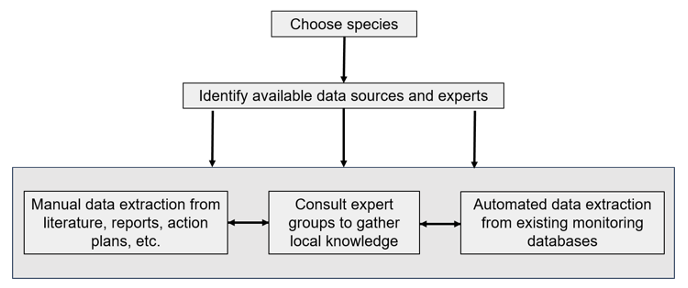

# Data sources

**For national level reporting of indicators, the default approach is to focus on data for  populations existing in the reporting country; a country is not obligated to report on populations existing entirely outside the country.** This is based on the idea that countries are responsible for conserving biodiversity within their national boundaries.  Of course, if countries are interested in the genetic status of the entire species range, or status in an adjacent country, etc. additional calculations of the indicator can be performed based on different geographic scales. Populations that are transboundary (e.g. part of the population exists in the reporting country) may be reported on. Global reporting of indicators would require data for all populations.

The amount of time and effort for collection of data will vary depending on the country and data source.  There are roughly three categories of data sources: 

(1) *automated*: Data from a centralized inventory of multiple to many species. Some countries may have a centralized database of many species (across taxonomic groups and levels of rarity) from which estimates of population sizes and counts of the number of populations can be extracted directly and quickly.  This may be especially the case for plants, long lived organisms, and those of high economic, ecological, conservation or cultural value.  Extracting data directly from computer files or tables is sometimes very straightforward and automatable (Figure [Process to identify data from different sources](https://aliciamstt.github.io/guidelines-genetic-diversity-indicators/docs/5_Data_collection/Data_sources.html#process-to-identify-data-from-different-sources-manual-expert-automated-to-assess-genetic-indicators-for-a-set-of-species-adapted-from-hoban-et-al-2023)).  

(2) *manual*: Collection of data for each species from various sources.  For many countries, we anticipate that data will need to be extracted manually by humans by reading reports, websites, planning documents, and/or expert consultation and extracting the quantification of populations maintained and population sizes ([Figure Process to identify data from different sources](ttps://aliciamstt.github.io/guidelines-genetic-diversity-indicators/docs/5_Data_collection/Data_sources.html#process-to-identify-data-from-different-sources-manual-expert-automated-to-assess-genetic-indicators-for-a-set-of-species-adapted-from-hoban-et-al-2023)). One source may suffice (e.g. a comprehensive report), while sometimes it may be necessary to consult more than one resource. 

(3) *expert*: Local communities or experts consultation.  For some species or regions, it will be most appropriate to consult people from local communities, staff from conservation initiatives (e.g. park rangers), or other stakeholders who know the species within their territories. The goal is to gather knowledge that is current but may not be published or written, but is known, including if possible with measures of uncertainty. Forming a panel or workshop of knowledge holders in a particular taxonomic group (e.g. amphibians, trees, etc.) also can be an efficient way to gather data on dozens of species in a short period of time. 

###### **Process to identify data from different sources** (manual, expert, automated) to assess genetic indicators for a set of species (adapted from [Hoban et al. 2023](https://conbio.onlinelibrary.wiley.com/doi/10.1111/conl.12953)).

. 

Below are some example data sources:

* **Occurrence points from National Biodiversity databases, GBIF or citizen science**. In some cases this can help define populations, define habitat area, and possibly even define lost populations if these points have high reliability. They should be interpreted with caution, because (i) not every occurrence is a population (as mentioned above) and (ii) such occurrence points might mix occurrences from different years, so spatial and temporal occurrences can be conflated (e.g. a GBIF map shows an extant population in a place because of old occurrences, but the population is actually extinct).

* **Endangered or declining species management reports.** Some countries have mechanisms to publish recovery plans, status, or other information about selected species. These reports often list current population sizes and current and sometimes historic range or population occurrence.

* **Local communities or experts consultation.** For some taxonomic groups it may be feasible and efficient to share the list of species to people from local communities or staff from conservation initiatives (e.g. park rangers) who know the species within their territories, or to a panel of experts (scientists, citizen scientists, naturalists) in a particular taxonomic group (e.g. amphibians, trees, etc.) who have unpublished knowledge and can provide measures of uncertainty. Convening a workshop (virtually or in person with a goal of discussion and consensus) of local people and/or experts can be an efficient way to gather data on dozens of species quickly.

* **IUCN Red List or NatureServe.** More than 100,000 species have been assessed by the IUCN Red List at global or national levels. These reports sometimes list current population sizes and current and sometimes historic range or population occurrence. Please remember that the genetic diversity indicator is different from the Red List Indicator, even though you can get data for the genetic indicator from the Red List assessment. The Red List is based on the **species-wide census**, **rather than the size of each population** (Confusingly, the Red List reports the species-wide census as “population”, and each population as a “sub-population”).

* **Literature or internet searches.** Scientific journal articles, websites of NGOs or societies, books, magazines, etc. sometimes present census size and current and historic range information. This may be especially useful for species with outdated Red List assessments (e.g. >10 years old) or where population level information is not otherwise available. Wikipedia, NatureServe, WWF, taxon specific NGOs, and other respected websites may also have relevant information.

If collecting data from a written source, each data source should be read thoroughly. Red List assessments and management plans might be 1 to 20 pages long (sometimes longer), and some reports on well studied species may exceed 100 pages. The text might clearly state the size of each population, with text, tables, or maps. However, data may be incomplete, such as listing the size of only the largest or smallest populations.  As noted above, it is ok to submit species for which some information is missing (see common Issues below). The time necessary to gather data from individual sources (and/or consult experts) may range from 45 minutes (for clear, short reports), to 5+ hours.

[Previous: Example assessments](https://aliciamstt.github.io/guidelines-genetic-diversity-indicators/docs/4b_Example_assessments/Example_assessments.html#example-assessments){: .btn .btn-blue .mr-4 }
[Next: Web-tool for data collection](https://aliciamstt.github.io/guidelines-genetic-diversity-indicators/docs/5_Data_collection/Web_tool.html#web-tool-for-data-collection-kobo){: .btn .btn-green }
