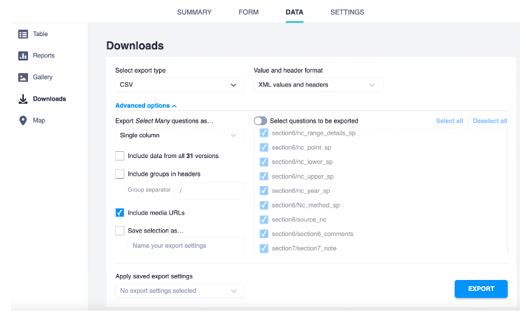

# KoboToolBox help

**Why kobo?**

The genetic indicators data collection form that we created (i.e., the questions in the Kobo form) can be downloaded and implemented in Kobo by anyone. Data collection efforts are confidential with no requirement for data sharing. 

Data collected using Kobo can be easily downloaded as a spreadsheet (.xlsx, .csv, etc file). We have created a set of R scripts that process the Kobo output to estimate the genetic diversity indicators and make nice plots.

With these tools, we aim to relieve some of the burden associated with choosing which data to collect and how to label it, data capture (accurate and secure data recording), and data evaluation (display figures, etc). 

**How to use Kobo to collect genetic diversity indicator data**

If you want to use this form to collect data for your country or desired species, **you can deploy your own version of the form** in Kobotoolbox as follows:

1. Create your own account of kobo in Kobotoolbox
2. Download the file [kobo_form.xlsx](https://github.com/AliciaMstt/GeneticIndicators/raw/main/kobo_form.xlsx) from this repository, which is the .xlsx version of the Kobo form (ie. the questions in the format kobo can read them).
3. Import it to Kobotoolbox following [these instructions](https://support.kobotoolbox.org/new_form.html).
   
Check [Kobotoolbox documentation](https://support.kobotoolbox.org/welcome.html) for further details on how to deploy and use it. You can also use our scripts (see below) to process the output in order to estimate the indicators.

**Downloading data from Kobo**

Once the form has been answered in kobo, you can download the data in .csv or .xlsx or other formats to analyze it in R, Excel or other software.

You can either analyze the data directly, or first run a quality check (revise the data to make sure it looks as expected, for instance that no species names were misspelled).

The R processing scripts and functions described in this guidelines assume that the data was downloaded from Kobotoolbox using the following settings:

The variables names in the exported data match the "name" column in the [kobo_form.xlsx](https://github.com/AliciaMstt/GeneticIndicators/raw/main/kobo_form.xlsx) survey tab. In the same file, you can check the question of the form it refers to in the "label" tab.

See section R scripts for calculation and reporting for scripts to process the Kobotoolbox output data and calculate the genetic diversity indicators.

