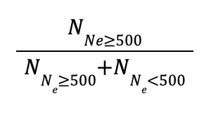
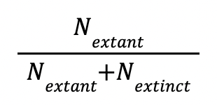

# Equations and example calculations 

Equation and definition of each indicator are in Table 1 and [Hoban et al (2023)](https://conbio.onlinelibrary.wiley.com/doi/10.1111/conl.12953). For calculating the Ne>500 indicator for each species, count the number of populations with Ne above 500 and the number with Ne below 500; these two added together should equal the total number of populations **for which data are available**. In the case in which Nc was recorded, estimates of Ne can be obtained by multiplying the Nc value by the Ne/Nc ratio. 0.1 is a conservative default value for all species' Ne/Nc ratio. Instead, a taxon-specific Ne/Nc ratio (either from that species or from a general taxa such as 0.3 for plants) can be used when it is available. 

The Ne 500 indicator can be reported as a decimal (from 0 to 1) or in the form of a ratio (in the format "Number of populations with Ne > 500" : "Number of populations since recording begun"). Recently extinct populations would have a size of 0 to avoid an increase in the indicator value when populations are lost.

In the case of differing estimates from multiple sources, the most recent reliable source should be used. Multiple sets of indicator values can also be calculated based on multiple sources for a single species (for instance, representing "optimistic" and "pessimistic" scenarios), and in some cases (if appropriate), a mean of the indicator values based on the different sources is taken. See the [How to account for uncertainty](https://ccgenetics.github.io/guidelines-genetic-diversity-indicators/docs/3_Howto_guides_examples/uncertainty.html#how-to-account-for-uncertainty-in-the-number-of-populations-population-size-or-nenc-ratio) page, for more information.

### Table 1: Equations for calculating the indicator values for each species

|                                                                                                                                 Ne > 500 Indicator                                                                                                                               |                                                                                                                                                   Populations Maintained (PM) Indicator                                                                                                                                                   |                                     Number of species being monitored using DNA-based methods                                     |
|:---------------------------------------------------------------------------------------------------------------------------------------------------------------------------------------------------------------------------------------------------------------------------------:|:-----------------------------------------------------------------------------------------------------------------------------------------------------------------------------------------------------------------------------------------------------------------------------------------------------------------------------------------:|:---------------------------------------------------------------------------------------------------------------------------------:|
| Proportion of populations with an effective population size (Ne) greater than 500.      **Note:** When Ne is unavailable, [measures of Nc can be used to estimate Ne](https://ccgenetics.github.io/guidelines-genetic-diversity-indicators/docs/3_Howto_guides_examples/Populations_sizes.html). 0.1 Ne/Nc conversion ratio is recommended if unknown. | Proportion of populations within a species that are maintained (i.e., extant populations) compared to the total number known (i.e., extant + extinct).       N is the number of extant or extinct populations within a species. **Note:**  A [See How to establish a reference period to estimate extinct populations](https://ccgenetics.github.io/guidelines-genetic-diversity-indicators/docs/3_Howto_guides_examples/Reference_period.html) | A count of the number of species where at least one population is being genetically (temporally) monitored with DNA-based methods |

Consider the example of hypothetical populations of fish shown in the figure below. Three of four historical populations are maintained, so the PM indicator is 3/4 = 0.75. Only one of the remaining populations is has an Ne >500, so the Ne 500 indicator is 1/3 = 0.33. DNA-based methods have not been used to monitor genetic diversity, so the DNA-based monitoring indicator is 0.

##### **Illustration of genetic diversity indicators for hypothetical populations**. Four hypothetical fish populations occur within a country. One fish = 1,000 mature fishes. Colors show genetic diversity. In the year the indicators were assessed, 1 population is extinct (lost), and only one is large enough (Ne > 500) to retain genetic diversity.

{: .important }
Note that the denominators of the Ne 500 and PM indicators are slightly different. For Ne 500, the denominator is the total number of existing populations **since reporting begun**, whereas for the PM indicator, the denominator is the number of populations **known to have previously existed**. Since the time frames for these may not be the same, the denominators used for the calculations of the Ne 500 and PM indicator may be different.

[Previous: Data collection](https://ccgenetics.github.io/guidelines-genetic-diversity-indicators/docs/5_Data_collection/Data_collection.html#data-collection){: .btn .btn-blue .mr-4 }
[Next: Calculating country indicator values](https://ccgenetics.github.io/guidelines-genetic-diversity-indicators/docs/6_Calculations_and_reporting/Country_ind_values.html#calculating-country-indicator-values){: .btn .btn-green }
