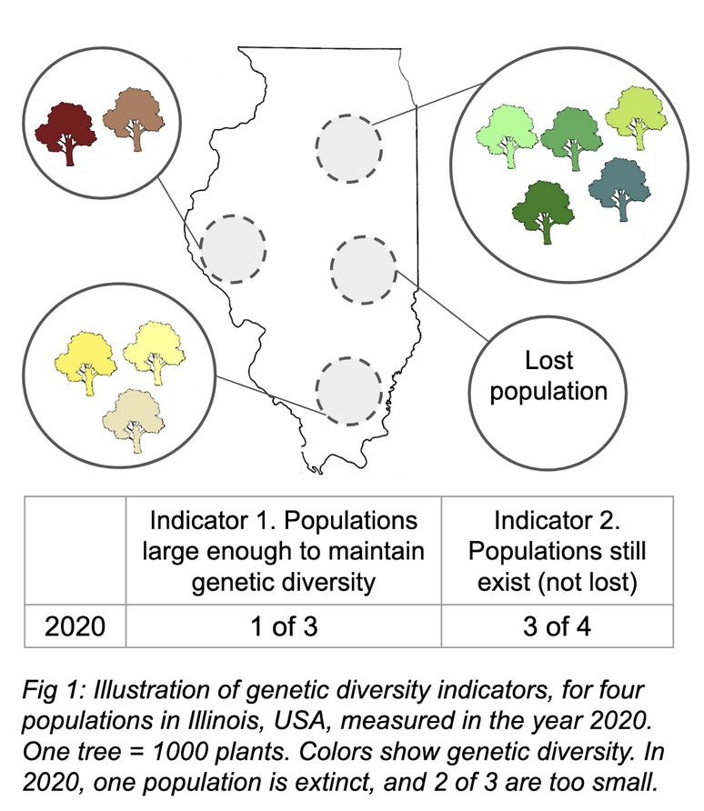

# Guideline materials and documentation for the Genetic Diversity Indicators

{: .highlight }
The information contained here is intended to assist nations in quantifying genetic indicator values at every stage of the process: from species selection to data compilation and finally to indicator calculation. These guideline materials are based on the co-creation experience of the first multinational assessment of the genetic diversity indicators, and we hope to keep updating them as more teams share their experience.

Genetic diversity is the foundation of all biological diversity, yet despite this, genetic variation has been often neglected by many global conservation initiatives; in large part due to the lack of simple and widely-applicable genetic diversity indicators. 

Following the U.N. Convention on Biological Diversity (CBD)’s Strategic Plan for Biodiversity 2011-2020, a critical gap in global biodiversity reporting was clear - knowledge on the status and trends of genetic diversity for most species. Starting in 2020, during the preparation of what would become the Kunming Montreal Global Biodiversity Framework three genetic diversity indicators were developed. These are the first indicators that can quantitatively estimate genetic status for all species, using existing data, in a rapid manner. 

The three new genetic diversity indicators were conceived using SMART (specific, measurable, achievable, realistic, and timely) criteria and can be quantified without using genetic data (e.g. without DNA sequences) - a key innovation enabling them to be applied across a wide range of taxa by countries with varying levels of resource capacities. 

The three genetic indicators are:

* **Effective population size (Ne) 500 indicator:** the proportion of populations within species with an effective population size (Ne) greater than 500. 

* **Populations Maintained (PM) indicator:** the proportion of maintained populations within species.

* **DNA-based monitoring  indicator:** number of species in which genetic diversity has been or is being monitored using DNA-based methods

Thus, the genetic diversity indicators adopted at COP15 by the Global Biodiversity Framework are based on these processes to monitor what affects genetic diversity.

The Ne 500 indicator measures the proportion of populations within a species that are of sufficient size to maintain genetic diversity and adaptive potential within that species.  When a population is below a certain size threshold (i.e., Ne 500), genetic diversity loss starts to occur, and at population sizes much smaller than this threshold, genetic diversity loss can be very rapid (Frankham 2021). So we want to maintain or restore populations above this Ne 500 threshold.  The ideal state for this indicator is a value of 1, indicating that all populations are of sufficient size (that each population is above Ne 500). For many species, it is sufficient and appropriate to use census size (Nc: the number of living adults) as a proxy for Ne, with the threshold translating to Nc = 5000 mature individuals.

The PM indicator measures the proportion of populations that still exist compared to the total number of populations that used to occur (i.e., it is a way of quantifying population extinctions). Each population is presumed to be genetically distinct and locally adapted, and hence loss of any population within a species equates to the loss of genetic diversity and a species’ unique genetic adaptations. Similar to the Ne 500 indicator, the ideal state for this indicator is a value of 1, indicating that no populations have been lost.

The DNA-based monitoring indicator tracks the number of species being monitored temporally using DNA-based methods. Unlike the other two indicators, the genetic monitoring indicator does not estimate the genetic health of a species. Instead, it is a proxy for knowledge that could support management of genetic diversity. It is a simple count of genetic studies that can be used to track the genetic monitoring efforts being undertaken in a country to help inform adaptive species management and possibly conservation policy. 

Over time, all of these indicators can be used to monitor progress in the overall genetic health of the biodiversity in a country, as well as species-specific recovery and general genetic management efforts. For a more in-depth look at the scientific underpinning of these indicators, see [Background](https://aliciamstt.github.io/guidelines-genetic-diversity-indicators/docs/2_Theoretical_background/Theoretical-background.html).

The next Figure illustrates how these indicators can be calculated for a species of tree.

The following video offers a short explanation of the genetic diversity indicators and the results of the first multinational assessment:

<iframe width="560" height="315" src="https://www.youtube.com/embed/FCIHRXB7Kn8?si=nSb3FFChKb-EtN7y" title="YouTube video player" frameborder="0" allow="accelerometer; autoplay; clipboard-write; encrypted-media; gyroscope; picture-in-picture; web-share" allowfullscreen></iframe>

## Current status in the Global Biodiversity Framework: 

In December 2022, 196 Parties to the CBD adopted the Kunming-Montreal Global Biodiversity Framework (GBF) and with it came the adoption of the Ne 500 and PM indicators in the accompanying global monitoring framework (Annex 1 of CBD/COP/DEC/15/5). Specifically, the Ne 500 indicator is a headline indicator for the GBF’s Goal A and Target 4 (see https://www.cbd.int/gbf/), which means Parties will be required to report on it in their national reporting.  The PM indicator is a complementary indicator to Goal A, which means countries are encouraged but not obligated to report on it. We advise, as noted in the metadata for indicator A.4, that both indicators should be reported.

## License

This repository is licensed under the The Creative Commons CC0 Public Domain [LICENSE](LICENSE). 

The documentation was developed by the genetic diversity indicator team. 

If you use any of the materials listed below, please cite: 

* Hoban, S., da Silva, J. M., Mastretta-Yanes, A., Grueber, C. E., Heuertz, M., Hunter, M. E., Mergeay, J., Paz-Vinas, I., Fukaya, K., Ishihama, F., Jordan, R., Köppä, V., Latorre-Cárdenas, M. C., MacDonald, A. J., Rincon-Parra, V., Sjögren-Gulve, P., Tani, N., Thurfjell, H., & Laikre, L. (2023). **Monitoring status and trends in genetic diversity for the Convention on Biological Diversity: An ongoing assessment of genetic indicators in nine countries**. *Conservation Letters*, 16(3), e12953. [https://doi.org/10.1111/conl.12953](https://doi.org/10.1111/conl.12953)

* Mastretta-Yanes\*, A., da Silva\*, J., Grueber, C. E., ... Laikre, L. & Hoban, S. (under review). **Multinational evaluation of genetic diversity indicators for the Kunming-Montreal Global Biodiversity Monitoring framework**. *EcoEvoRxiv* (Pre-Print). https://ecoevorxiv.org/repository/view/6104/. DOI: [https://doi.org/10.32942/X2WK6T](https://doi.org/10.32942/X2WK6T)
