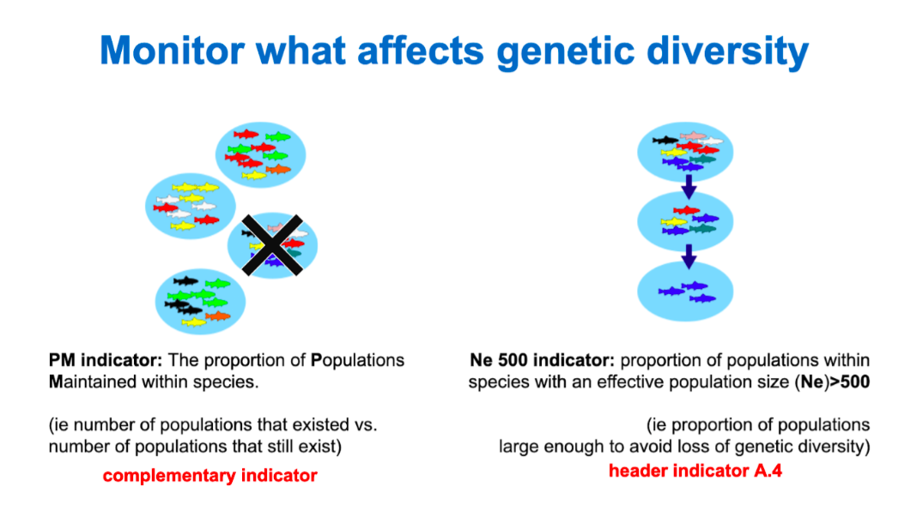
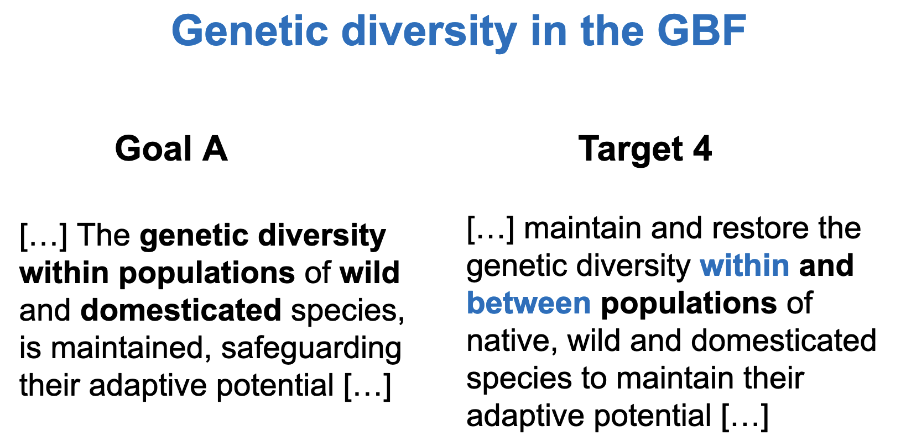

# Guideline materials and documentation for the Genetic Diversity Indicators of the monitoring framework for the Kunming-Montreal Global Biodiversity Framework

{: .highlight }
This guide is intended to assist national and subnational entities in quantifying genetic indicator values at every stage of the process: from species selection to data compilation to indicator calculation. These materials are based on the co-creation experience of the [first pilot multinational assessment of the genetic diversity indicators](https://ecoevorxiv.org/repository/view/6104/) and we hope to keep updating them as more teams share their experience. If you would like to provide feedback or have questions please [get in touch](https://groups.google.com/g/genetic-indicators-project).

Genetic diversity is the foundation of all biological diversity. It is **necessary for species’ populations to remain healthy and adapt to environmental change**, such as climate change, pollution, changing habitats, pests and disease. Genetic diversity is **also vital for resilience of all ecosystems** (i.e., recovery from heat waves and ocean pollution or acidification) and for the success of ecosystem restoration and the reintroduction of populations and species. Populations with low genetic diversity suffer inbreeding, low viability, and low resilience. Unfortunately, genetic diversity has declined due to habitat loss, fragmentation, overharvest, and other human activities. Yet despite all of this, genetic variation has been often neglected by many global conservation initiatives, partly due to the lack of simple and widely-applicable genetic diversity indicators. 

Following the U.N. Convention on Biological Diversity's (CBD) Strategic Plan for Biodiversity 2011-2020, a critical gap in global biodiversity reporting was clear - knowledge on the status and trends of genetic diversity for most species. Starting in 2020, during the preparation of what would become the Kunming Montreal Global Biodiversity Framework three genetic diversity indicators were developed. These are the first indicators that can quantitatively estimate genetic status for all species, using existing data, in a rapid manner. 

The three new genetic diversity indicators were conceived using SMART (specific, measurable, achievable, realistic, and timely) criteria and can be quantified *without using genetic data (e.g. without DNA sequences*) - a key innovation enabling them to be applied across a wide range of taxa by countries with varying levels of resource capacities. 

The three genetic indicators are:

* **[Effective population size (Ne) 500 indicator](https://ccgenetics.github.io/guidelines-genetic-diversity-indicators/docs/2_Theoretical_background/Ne-500.html):** the proportion of populations within species with an effective population size (Ne) greater than 500. 

* **[Populations Maintained (PM) indicator](https://ccgenetics.github.io/guidelines-genetic-diversity-indicators/docs/2_Theoretical_background/PM-indicator.html):** the proportion of maintained populations within species.

* **[DNA-based monitoring  indicator](https://ccgenetics.github.io/guidelines-genetic-diversity-indicators/docs/2_Theoretical_background/DNA-based-monitoring-indicator.html):** number of species in which genetic diversity has been or is being monitored using DNA-based methods

Thus, the genetic diversity indicators adopted at COP15 by the Global Biodiversity Framework are based on these processes to monitor what affects genetic diversity.

The Ne 500 indicator measures **the proportion of populations within a species that are of sufficient size to maintain genetic diversity and adaptive potential** within that species. When a population is below a certain size threshold (i.e., Ne 500), genetic diversity loss starts to occur, and at population sizes much smaller than this threshold, genetic diversity loss can be very rapid ([Frankham 2021](https://link.springer.com/article/10.1007/s10592-021-01357-y)). So it is important to maintain or restore populations above this Ne 500 threshold. The ideal state for this indicator is a value of 1, indicating that all populations are of sufficient size (that each population is above Ne 500). For many species, it is sufficient and appropriate to use census size (Nc: the number of living adults) as a proxy for Ne, with the default threshold translating to Nc = 5000 mature individuals (though see Section [How to estimate population sizes](https://ccgenetics.github.io/guidelines-genetic-diversity-indicators/docs/3_Howto_guides_examples/Populations_sizes.html#how-to-estimate-population-sizes)). **The Ne 500 indicator is likely the best evidence of genetic status and risk of genetic erosion when DNA sequencing is not available (the case for most species globally)**.

The PM indicator measures **the proportion of populations that still exist compared to the total number of populations that used to occur** (i.e., it is a way of quantifying population extinctions). Each population is presumed to be genetically distinct and locally adapted, and hence loss of any population within a species equates to the loss of genetic diversity and a species’ unique genetic adaptations. The ideal state for this indicator is a value of 1, indicating that no populations have been lost.

The DNA-based monitoring indicator **tracks the number of species being monitored temporally using DNA-based methods**. Unlike the other two indicators, the genetic monitoring indicator does not estimate the genetic health of a species directly. Instead, it is a proxy for knowledge that could support management of genetic diversity. It is a simple count of genetic studies that can relate to genetic monitoring efforts being undertaken in a country and/or relate to informing management of genetic diversity. 

Over time, all of these indicators can be used to monitor progress in the overall genetic health of the biodiversity in a country, as well as guide species-specific recovery and management. For a more in-depth look at the scientific underpinning of these indicators, see [Background](https://ccgenetics.github.io/guidelines-genetic-diversity-indicators/docs/2_Theoretical_background/Theoretical-background.html).

The next Figure illustrates how these indicators can be calculated for a species of fish.

###### **Illustration of genetic diversity indicators for hypothetical populations.** Four hypothetical fish populations occur within a country. One fish = 1000 mature fishes. Colors show genetic diversity. In the year the indicators were assessed, 1 population is extinct (lost), and only one is large enough (Ne > 500) to retain genetic diversity.

## Current status in the Global Biodiversity Framework: 

In December 2022, 196 Parties to the CBD adopted the [Kunming-Montreal Global Biodiversity Framework (GBF)](https://www.cbd.int/doc/c/e6d3/cd1d/daf663719a03902a9b116c34/cop-15-l-25-en.pdf) and with it came the adoption of the Ne 500 and PM indicators in the accompanying global monitoring framework (Annex 1 of CBD/COP/DEC/15/5). Specifically, **the Ne 500 indicator is a headline indicator for the GBF’s Goal A and Target 4** (see [here](https://www.cbd.int/doc/decisions/cop-15/cop-15-dec-04-en.pdf)), which means Parties will be required to report on it in their national reporting.  **The PM indicator is a complementary indicator to Goal A**, which means countries are encouraged but not obligated to report on it. We advise, as noted in the metadata for indicator A.4, that both indicators should be reported.

###### Components of Goal A and Target 4 of the Global Biodiversity Framework that specifically address genetic diversity.

The Ne 500 indicator is directly relevant to **Goal A**, as it informs the health and resilience of species’ populations, their genetic diversity, and the threat of species extinction. Knowledge of species population’s effective size is relevant to **Target 4** as it facilitates active management of species, ex situ breeding programs and informs the conservation efforts and recovery process of species populations following environmental disruption. The Ne 500 indicator is a Headline indicator for Goal A and Target 4.

The complementary indicator for Goal A, the “proportion of populations maintained”, is necessary for maintaining genetic diversity among populations. This indicator is directly relevant to addressing the “between populations” portion of **Target 4**, despite the GBF not making a direct link. Both the Ne 500 and PM indicators complement each other, and **experts agree that both are critical for assessing and monitoring the genetic health of species** (Hoban et al 2020, Hoban et al 2023b). Helpfully, quantifying the PM indicator (understanding the number of populations within a species - both extant and extinct) can be performed simultaneously to quantifying the Ne 500 indicator.

Genetic diversity is vital for meeting several targets ([Hoban et al. 2023](https://link.springer.com/article/10.1007/s10592-022-01492-0), [2020](https://www.sciencedirect.com/science/article/pii/S0006320720307126); [Hoban, Campbell, et al. 2021](https://www.sciencedirect.com/science/article/pii/S0006320721002858); [Bolam et al. 2023](https://esajournals.onlinelibrary.wiley.com/doi/full/10.1002/fee.2537)) such as **target 2** (effective restoration), **target 3** (30% area in effectively governed PAs and OECMs), **target 4** (management actions for recovering species and conserving genetic diversity), **target 6** (reducing invasive species), **target 8** (minimize climate impacts), **target 9** (sustainable use of wild species), **target 10** (sustainable fisheries, forestry, agriculture), **target 11** (restoring and sustaining ecosystem services), and **target 13** (equitable sharing of genetic resources).

The utility of these indicators is not confined to CBD reporting and Parties to its conventions. All national and subnational entities, and regional groups, are encouraged to start quantifying these indicators to better understand the genetic status of their biodiversity to better inform biodiversity management and track species recovery.

The following video offers a short explanation of the genetic diversity indicators and the results of the a [pilot multinational assessment](https://ecoevorxiv.org/repository/view/6104/):

<iframe width="560" height="315" src="https://www.youtube.com/embed/FCIHRXB7Kn8?si=nSb3FFChKb-EtN7y" title="YouTube video player" frameborder="0" allow="accelerometer; autoplay; clipboard-write; encrypted-media; gyroscope; picture-in-picture; web-share" allowfullscreen></iframe>

## License

This documentation is dual-licensed under CC BY 4.0. Attribution 4.0 Internationa for the media and all non-software materials and MIT License for the scripts and other provided code [LICENSE](https://raw.githubusercontent.com/CCGenetics/guidelines-genetic-diversity-indicators/main/LICENSE). The repository uses the [Just the Docs](https://just-the-docs.com/) theme.  

If you use any of the materials of these guidelines **please cite**:

Mastretta-Yanes, A., Sofía Suárez, Rebecca Jordan, Sean Hoban, Jessica M. da Silva, Luis Castillo-Reina, Myriam Heuertz, Fumiko Ishihama, Viktoria Köppä, Linda Laikre, Joachim Mergeay, Ivan Paz-Vinas, Gernot Segelbacher, Alicia Knapps, Henry Rakoczy, Amelie Weiler & Brenna R. Forester. (2024) Biodiversity Informatics. Guideline materials and documentation for the Genetic Diversity Indicators of the monitoring framework for the Kunming-Montreal Global Biodiversity Framework. [https://journals.ku.edu/jbi/article/view/22332](https://journals.ku.edu/jbi/article/view/22332)

## Acknowledgments

These materials are based on the co-creation experience of the [first pilot multinational assessment of the genetic diversity indicators](https://ecoevorxiv.org/repository/view/6104/), and on interactions with practitioners, researchers and students of several institutions across the world. We are particularly grateful to the Swedish Environmental Protection Agency, the Ad Hoc Technical Expert Group on Indicators for the Kunming-Montreal Global Biodiversity Framework, and to the following people for providing feedback and ideas: Akio Takenaka, Alejandra Domínguez Álvarez, Alexander Llanes-Quevedo, Alice Hughes, Ana Wegier, Ashley Hamilton, Atsaves Angelica, Austin Koontz, Bastian Silva, Belma Kalamujić Stroil, Caitlin Miller, Catherine E Grueber, Chris Funk, Emma Suzuki Spence, Erica Robertson, Eugenia Zarza, Fleur Visser, Gaëlle Brahy, Georgina Wood, Glenn M Shea, Henrik Thurfjell, Hesiquio Benitez, Irene Ramos, Iris Lang, Isa-Rita Russo, Juan Francisco Ornelas, Katie Millette, Keiichi Fukaya, Kira Cullmann, Libertad Arredondo-Amezcua, Lily Durkee, Lucía Ruíz, Luke Dedecke, Malte Julius Benedikt Lehmann, Malte Lehmann, Margaret E. Hunter, Maria Alejandra Rodriguez-Morales, María Camila Latorre, Marlien van der Merwe, Matt DeSaix, Meg Mahoney, Metztli Arcila Santiago, Mónica Alegre, Paulette Bloomer, Per Sjögren-Gulve, Philipp Ungar, Robyn E. Shaw, Santiago Ramírez-Barahona, Sheela Turbek, Simone Bagnato, Sofía Treviño, Tanya Latty, Taylor Stack & Victor Julio Rincon-Parra.

:)

[Next: Background](https://ccgenetics.github.io/guidelines-genetic-diversity-indicators/docs/2_Theoretical_background/Theoretical-background.html#background){: .btn .btn-green }
